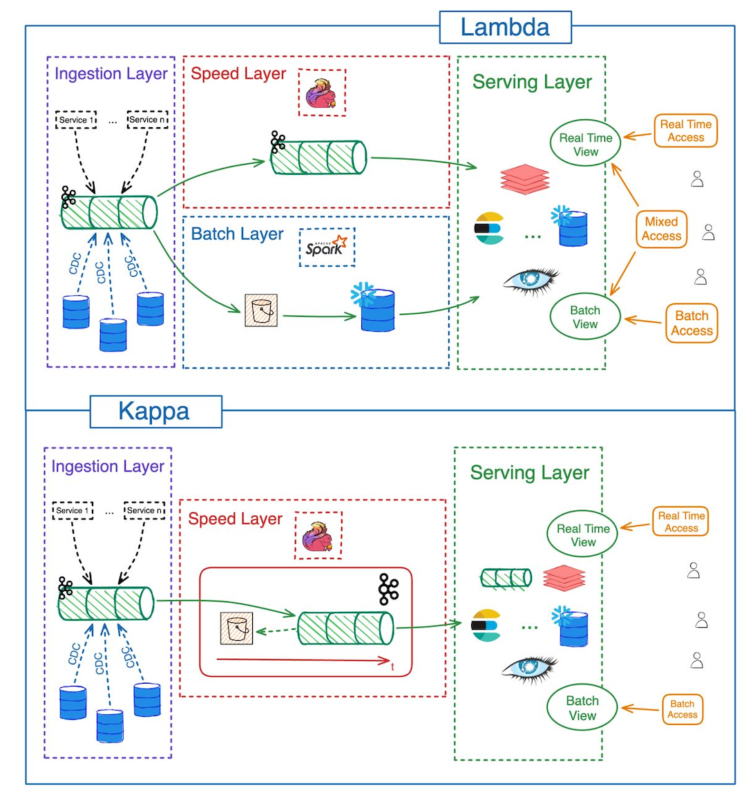

# FinPulse-Fraud

Fraud detection & transaction analytics on a HDFS / Spark / Kafka / Flink /
Pinot / PrestoDB-on-HMS / Superset / Airflow stack, following the
[Robinhood data infrastructure](docs/odsc/robinhood_infrastructure.md)
pattern (Kafka → Flink → Pinot for streaming, Spark + HMS + Presto for the
batch / granular DWH side).
See [`docs/scenario.md`](docs/scenario.md) for the project brief.

The streaming + dual-serving-layer architecture (Spark batch + Kafka + Flink
streaming + Pinot real-time OLAP + PrestoDB-on-HMS for granular SQL) is
inspired by **[Deep Patel](https://www.linkedin.com/in/deeppatel710/)**'s
ODSC talks on building production data clusters with Spark, Kafka, Flink,
Pinot, and Presto. The Robinhood reference architecture our diagrams
trace lives at [`docs/odsc/robinhood_infrastructure.md`](docs/odsc/robinhood_infrastructure.md).

## References

Background reading that informed the component choices in this stack
(all from [VuTR](https://vutr.substack.com)):

**Per-component primers:**

- HDFS — [The Hadoop Distributed File System](https://vutr.substack.com/p/i-spent-8-hours-reading-the-paper-523) (paper walk-through)
- Spark — [The Overview of Apache Spark](https://vutr.substack.com/p/the-overview-of-apache-spark)
- Pinot — [A Glimpse of Apache Pinot, the Real-Time OLAP Database](https://vutr.substack.com/p/a-glimpse-of-apache-pinot-the-real)
- Druid (Pinot's closest alternative) — [The Architecture of Apache Druid](https://vutr.substack.com/p/the-architecture-of-apache-druid)
- Hive — [What is Apache Hive?](https://vutr.substack.com/p/what-is-apache-hive)
- Presto — [8 Minutes to Understand Presto](https://vutr.substack.com/p/8-minutes-to-understand-presto)
- Airflow — [Data Engineering System Design: Orchestration](https://vutr.substack.com/p/data-engineering-system-design-orchestration)

**Architecture / system design:**

- [Data engineering system design: 11 data sourcing problems](https://vutr.substack.com/p/data-engineering-system-design-11) — ingestion-layer trade-offs
- [Data engineering system design: 9 data serving problems](https://vutr.substack.com/p/data-engineering-system-design-9) — serving-layer trade-offs

## Architecture: Lambda



This stack is **Lambda**. Three layers, each owning a different concern:

- **Batch layer (Spark)** — reads Kafka by offset range, joins with
  HDFS dim tables, writes feature stores in `/analytics/*` and Pinot
  offline segments. Owns historical correctness, ML training, and
  heavy joins.
- **Speed layer (Flink)** — continuously stream-scores Kafka events
  with event-time semantics + exactly-once via two-phase commit, emits
  `transactions-scored` and `fraud-alerts`. Owns low-latency freshness.
- **Serving layer (Pinot hybrid table)** — merges Flink's real-time
  segments with Spark's offline segments at query time. The classic
  Lambda merge.

The defining property: Spark and Flink run **different code paths
with different logic** — Spark does batch feature engineering +
offline scoring; Flink does stateful event-time scoring on the live
stream. **Kappa** would be a *single* streaming codepath where "batch"
just means replaying earlier Kafka offsets of the same job. We have
two jobs, not one — that's Lambda.

Spark batch-reading Kafka (instead of an HDFS master fact dataset) is
a **modernization** of classic Lambda, not a switch to Kappa. We pay
the Lambda tax — two codepaths to keep semantically aligned — to get
Spark's batch flexibility *and* Flink's streaming semantics in the
same stack.

## Infrastructure

What each component does in this stack:

| Component        | Role                                                                                              |
|------------------|---------------------------------------------------------------------------------------------------|
| **HDFS**         | Data lake storage — landing + curated dim datasets and `/analytics/*` Spark batch outputs (Parquet). Transactions live in Kafka, not here. |
| **Kafka**        | Streaming source of truth for the `transactions` fact stream. Spark batch-reads it by offset; Flink stream-reads it continuously. Three topics: `transactions`, `transactions-scored`, `fraud-alerts`. |
| **Spark**        | Batch compute — joins Kafka transactions with HDFS dimensions, builds the feature store, runs offline rule + ML scoring, writes Pinot offline segments. Registers tables in HMS via `saveAsTable`. |
| **Flink**        | Real-time stream scoring — Kafka → Flink → Kafka, event-time native, exactly-once via two-phase commit. Emits `transactions-scored` (every event) and `fraud-alerts` (risk ≥ 2). |
| **Pinot**        | Real-time OLAP serving — `transactions_scored` hybrid table with a real-time path from Kafka and a nightly Spark-built offline path from HDFS. Sub-second on pre-aggregated dashboards. |
| **Hive Metastore** | Catalog layer (Postgres-backed) — registers every `/curated/*` and `/analytics/*` table so Presto can find them by name. Decouples *catalog* from *storage* and *engine*. |
| **PrestoDB**     | DWH serving for *granular* Parquet — distributed SQL engine reading HDFS via the Hive connector + HMS catalog. Complements Pinot: arbitrary joins and full row detail at second-scale latency. |
| **Superset**     | BI / dashboards on top of **both** Pinot (live) and Presto (granular ad-hoc), via two SQLAlchemy drivers (`pinotdb`, `pyhive[presto]`). |
| **Airflow**      | Orchestration — nightly batch DAG (landing → curate → enrich → score → Pinot offline + HMS register) and a streaming-monitor DAG (Flink job liveness + checkpoint age + alert rate). |

### Why this lineup

Three pairings drive the design:

- **Spark + Flink** — fraud detection genuinely needs both flexibility
  and freshness. Spark for batch (heavy joins, ML training,
  deterministic backfills, full historical re-scoring); Flink for
  streaming (event-time windowing, exactly-once via two-phase commit,
  sub-second alerts). That's Lambda's two-codepath cost in exchange
  for both properties in the same stack.
- **Flink, not Spark Structured Streaming** — Spark's streaming is
  micro-batch with processing-time semantics. Fraud velocity windows
  need to respect the *txn* timestamp (event-time), and the
  `transactions-scored` and `fraud-alerts` topics must never disagree
  about whether a given event was seen (exactly-once 2PC).
- **Pinot + Presto** — they answer different questions. Pinot serves
  *known* dashboard queries (sub-second, pre-aggregated, fixed schema
  on the `transactions_scored` hybrid table); Presto serves *unknown*
  ad-hoc SQL over granular Parquet at second-scale latency with full
  row detail. Stakeholder dashboards hit Pinot; analyst notebooks hit
  Presto. No single engine is fast *and* flexible — running both pays
  for itself when the workload spans both kinds of question.

Per-service deep-dive (image, ports, volumes, configuration, "why this
shape", caveats) lives under
[`docs/infrastructure/`](docs/infrastructure/index.md) — one doc per
component. End-to-end data flow is in
[`docs/plans/dataflow.md`](docs/plans/dataflow.md).

## Layout

```text
docker-compose.yml   # HDFS + Spark + Kafka + Airflow + Pinot + Superset + Flink + HMS + PrestoDB
Makefile             # up / down / logs / smoke / nuke
plan.md              # End-to-end build plan, 10 small steps
.env.example         # Optional pip add-ons for Airflow

airflow/             # DAGs, plugins, task logs
data/                # Source datasets (gzipped CSV / JSON)
docker/              # Bind-mounted config for Hadoop, Spark, Superset, Flink, HMS, Presto
docs/                # scenario.md (brief), infrastructure/ (per-container ref), plans/ (dataflow + plan)
jobs/                # Spark jobs (batch curate / enrich on HDFS Parquet)
notebooks/           # Analysis notebooks answering the 7 business questions
scripts/             # Host-side helpers (smoke.sh, generate_data.py)
src/producer/        # Kafka producers (replays transactions.csv.gz to Kafka)
src/consumer/        # Non-Spark stream consumers (e.g., Flink fraud-scoring app)
utils/               # Standalone CLI utilities (Pinot schema loaders, ad-hoc Kafka inspectors, one-off data fixers)
```

Per-service reference (image, ports, volumes, configuration, caveats) lives
under [`docs/infrastructure/`](docs/infrastructure/index.md) — one doc per
component (HDFS, Spark, Kafka, Airflow, Pinot, **PrestoDB**, Superset, Flink).

## Service map

| Service             | Host port | Container port  | Notes                                                            |
|---------------------|-----------|-----------------|------------------------------------------------------------------|
| HDFS NameNode UI    | 9870      | 9870            | <http://localhost:9870>                                          |
| HDFS NameNode RPC   | 9000      | 9000            | for `hdfs://namenode:9000` clients                               |
| Spark Master UI     | 8080      | 8080            | <http://localhost:8080>                                          |
| Spark Master RPC    | 7077      | 7077            | `spark://spark-master:7077`                                      |
| Kafka broker        | 9092      | 9092 (EXTERNAL) | host clients: `localhost:9092`; in-network: `kafka:9094`         |
| Kafdrop             | 9001      | 9000            | <http://localhost:9001> (moved off 9000 to avoid HDFS RPC clash) |
| Airflow web         | 8081      | 8080            | <http://localhost:8081> — `admin` / `admin`                      |
| Pinot Controller UI | 9100      | 9000            | <http://localhost:9100> (moved off 9000 to avoid HDFS RPC clash) |
| Pinot Broker        | 8099      | 8099            | Pinot SQL query endpoint (used by Superset + smoke check)        |
| Superset            | 8088      | 8088            | <http://localhost:8088> — `admin` / `admin`                      |
| Flink Jobmanager UI | 8082      | 8081            | <http://localhost:8082> (moved off 8081 to avoid Airflow clash)  |
| PrestoDB Coordinator| 8086      | 8080            | <http://localhost:8086> SQL + Web UI (moved off 8080 to avoid Spark clash) |

Spark runs as **1 master + 2 workers** (2 cores, 2 GB each) so the
nightly Airflow DAG can run two batch jobs in parallel (e.g.
`build_enriched_fact` and `build_pinot_offline_segments`). Streaming
runs on Flink (1 jobmanager + 1 taskmanager, 4 task slots). HDFS runs
as **1 NameNode + 2 DataNodes** so replication > 1 is actually exercised.

The serving layer is **two engines, two roles**: Pinot for the
*pre-aggregated streaming* `transactions_scored` hybrid table
(sub-second on a fixed schema), and PrestoDB-on-HMS for *ad-hoc SQL
over granular Parquet* in HDFS (second-scale, arbitrary joins).
Superset connects to both. See
[`docs/infrastructure/presto.md`](docs/infrastructure/presto.md).

## Prerequisites

- Docker Desktop with **≥ 10 GB RAM, 4+ CPUs** allocated.
  **You may need to bump this to 12 GB** if you keep the stack up
  for more than ~1 hour: JVM heaps in Kafka / Flink / Pinot creep
  upward over time (`make smoke` adds a transient ~1 GB Spark
  surge on top), and at 10 GB the kernel will OOM-kill Presto
  mid-smoke once the resident set crosses ~9.7 GB. A fresh
  `make down && make up` resets heaps to baseline and recovers,
  but the durable fix is to give Docker more memory:
  Docker Desktop → Settings → Resources → Memory → 12 GB.
  Symptoms: `make smoke-presto` fails at the Spark→HMS→Presto
  round-trip step; `docker inspect presto-coordinator
  --format '{{.State.OOMKilled}}'` returns `true`.
- Apple Silicon and amd64 both supported (all images are multi-arch).
  PrestoDB prints *"Support for the ARM architecture is experimental"*
  on arm64 — advisory, not a failure.

## First-time bring-up

```sh
make env                # one-time: copy .env.example -> .env
make hive-deps          # one-time: download Postgres JDBC driver (~1.2 MB) for HMS
docker compose pull     # ~6 GB of images, one-time
make up                 # ~60-90s until everything is healthy
make smoke              # every smoke check (HDFS / Kafka / Spark / Airflow / Pinot / Flink / Presto)
```

## Common targets

| Target                   | What it does                                                                 |
|--------------------------|------------------------------------------------------------------------------|
| `make up`                | Start the full stack                                                         |
| `make up-core`           | HDFS + Spark + Kafka only (skip Airflow)                                     |
| `make up-bi`             | Pinot + Superset + HMS + Presto (skip everything else)                       |
| `make up-dwh`            | Just the HMS stack (Postgres + hive-metastore-init + hive-metastore)         |
| `make hive-deps`         | One-time: download Postgres JDBC driver to `docker/hive-metastore/jars/`     |
| `make down`              | Stop containers, keep volumes                                                |
| `make nuke`              | Stop **and delete** all volumes (HDFS / Kafka / Postgres / HMS / Pinot / …)  |
| `make ps`                | Show running services                                                        |
| `make logs s=<service>`  | Tail logs for one service, e.g. `make logs s=namenode`                       |
| `make smoke`             | Every smoke check: HDFS / Kafka / Spark / Airflow / Pinot / Flink / Presto    |
| `make smoke-airflow`     | Trigger the smoke DAG and wait for `success`                                  |
| `make smoke-presto`      | Spark `saveAsTable` -> HMS -> Presto SQL round-trip                           |

## Data

Source datasets live in [`data/`](data/) and were copied from
`prof-tcsmith/ism6562s26-class/final-projects/data/05-finpulse-fraud`.
All files are gzip-compressed; Spark reads `*.csv.gz` and `*.json.gz`
natively, so no manual `gunzip` is needed.

| File                          | Size  | Records   |
|-------------------------------|-------|-----------|
| `transactions.csv.gz`         | 24 MB | 1,000,000 |
| `device-fingerprints.csv.gz`  | 7.3 MB | 600,000   |
| `customer-profiles.json.gz`   | 2.8 MB | 100,000   |
| `fraud-reports.json.gz`       | 284 KB | 15,000    |
| `merchant-directory.csv.gz`   | 143 KB | 10,000    |

To regenerate the dataset from scratch (seed `2041`, deterministic):
`python3 scripts/generate_data.py` — overwrites `data/*.gz` in place.

## Caveats / known follow-ups

1. **Kafka connector** is *not* baked into the Spark image. Spark batch
   jobs that read Kafka topic `transactions` (the source of truth for
   transaction facts — see `docs/plans/dataflow.md`) need
   `--packages org.apache.spark:spark-sql-kafka-0-10_2.12:3.5.1` on
   `spark-submit`. First run downloads the JAR; bake into a custom image
   later if startup time matters. Flink ships its own Kafka connector
   bundled into the image.
2. **`data/*.gz` is not gitignored** but `transactions.csv.gz` (24 MB) is past
   GitHub's recommended file size. Decide whether to commit it or rely on
   `scripts/generate_data.py` / re-download.
