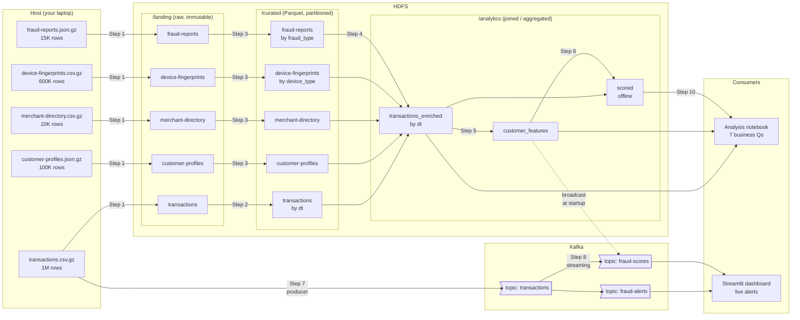

# Dataflow — end to end

This doc explains how the five raw datasets in `data/` move through the
stack and end up powering two different consumers: an **analysis
notebook** (batch reader) and a **Streamlit dashboard** (streaming
reader). It complements [`plan.md`](../plan.md) — the plan tells you
*what to build in what order*; this doc tells you *what data is moving
and why*.

## Mental model: two flows that share one bridge

Your intuition is right: there are **two flows**, not one.

1. **Batch flow** — the historical, file-driven path. Everything in
   `data/*.gz` lands in HDFS, gets cleaned to Parquet, joined into a
   wide enriched fact, and aggregated into a customer feature store.
   This is what offline analysis reads.
2. **Streaming flow** — the real-time, event-driven path. A producer
   replays `transactions.csv.gz` row-by-row into a Kafka topic, a
   Spark Structured Streaming job scores each event, and alerts go to
   another Kafka topic that a dashboard tails.

But they are **not independent pipelines** — they meet at the
**customer-features Parquet**. Batch builds it; streaming
broadcast-loads it on startup and uses it to score every incoming
transaction. Without the batch flow, the streaming flow has no
"normal" baseline to compare against.

```
            BATCH FLOW                          STREAMING FLOW
            (build the baseline)                (use the baseline live)
                                                
          /landing/                                  transactions.csv.gz
              ↓                                              ↓
          /curated/                                    Kafka producer
              ↓                                              ↓
   /analytics/transactions_enriched/             Kafka topic 'transactions'
              ↓                                              ↓
   /analytics/customer_features/  ──── broadcast ───→  Spark Streaming
              ↓                                              ↓
       offline scoring                            Kafka topics
              ↓                                  'fraud-scores' / 'fraud-alerts'
       analysis notebook                                     ↓
                                                   Streamlit dashboard
```

The arrow from `customer_features` into the streaming job is the
**bridge**. It's a one-time read at job startup; the streaming job
holds those ~100K rows in driver memory and ships them to every
executor.

## Where the raw files come from

`data/*.gz` was produced by `scripts/generate_data.py` — a one-time
offline generator that synthesizes the five datasets with planted
fraud signals (seed `2041` for reproducibility). It is **not** a
runtime component: it runs once on the host, writes the gz files,
and is never invoked again. It is unrelated to the Kafka producer
in Step 7 (which will live at `producers/replay_transactions.py`).
Treat `generate_data.py` as sitting *before* the diagram below —
it's the upstream provider we pretend already gave us a 6-month
dump.

## End-to-end diagram



Solid arrows are **events / files** moving. The dotted arrow from
`customer_features` to the streaming job is the **broadcast read** —
data does not flow through Kafka; the streaming job opens HDFS once
on startup, loads the Parquet, and keeps it in memory.

## Batch flow — walkthrough

```
data/*.gz   ─►  /landing  ─►  /curated  ─►  /analytics  ─►  notebook
             (Step 1)      (Steps 2-3)    (Steps 4-6)     (Step 10)
```

**What moves where:**

1. **`data/` → `/landing`** *(Step 1, raw upload)*
   - Files are copied as-is. `.gz` stays gzipped. No schema, no parse.
   - Replication 3 for `fraud-reports` and `customer-profiles`
     (audit + regulatory); replication 2 for the others.
   - **Why immutable.** If a downstream job corrupts data, we can
     always re-derive curated from landing. Landing is the
     source-of-record for what the upstream provider gave us.

2. **`/landing` → `/curated`** *(Steps 2-3, clean to Parquet)*
   - `transactions` partitioned by `dt` (date from timestamp) — every
     downstream query filters by time, so partition pruning is huge.
   - `device-fingerprints` partitioned by `device_type` (mobile /
     desktop / tablet) — a few queries split on this.
   - Dimensions (`customer-profiles`, `merchant-directory`) — no
     partitioning, they're small and always broadcast-joined.
   - `fraud-reports` partitioned by `fraud_type`.
   - **Why Parquet.** Columnar means we only read the columns we
     need; predicate pushdown means filters happen before
     deserialization; ~5–10× smaller than gzipped CSV.

3. **`/curated` → `/analytics/transactions_enriched`** *(Step 4)*
   - One wide table: `transactions` LEFT JOIN devices LEFT JOIN
     fraud-reports, INNER JOIN broadcast(customers + merchants).
   - Adds the label column `confirmed_fraud`.
   - **Why LEFT for some, INNER for others.** Devices and
     fraud-reports are sparse — not every txn has a fingerprint, and
     only ~2% have a fraud report. Customers and merchants are
     guaranteed (referential integrity in the generator).
   - **Label leakage warning.** `fraud_reports.timestamp` happens
     *after* the txn — useful for the batch label, dangerous if you
     ever feed it to a model as a feature. The streaming flow never
     sees this column.

4. **`/analytics/transactions_enriched` → `/analytics/customer_features`** *(Step 5)*
   - One row per `card_id`. Aggregates: avg/stddev/p95 amount, txn
     count, distinct merchants/countries, plus static fields from
     customer-profiles (home country, monthly spend).
   - **This is the feature store.** It is small (~100K rows, a few
     MB Parquet), self-contained, and PII-light. It's the bridge to
     streaming.

5. **`/analytics/scored` → notebook** *(Steps 6, 10)*
   - Offline scoring applies rules + (optional) ML to the enriched
     fact and writes per-txn predictions.
   - The notebook reads `/analytics/*` directly via PySpark to
     answer the 7 business questions in `docs/scenario.md`.

## Streaming flow — walkthrough

```
transactions.csv.gz  ─►  Kafka 'transactions'  ─►  Spark Streaming  ─►  Kafka 'fraud-alerts'  ─►  Streamlit
   (host file)            (Step 7 producer)        (Step 8 job)              (sink)              (consumer)
```

**What moves where:**

1. **`transactions.csv.gz` → Kafka topic `transactions`** *(Step 7, producer)*
   - A small Python script reads the gz file row-by-row and publishes
     each row as a JSON value, **keyed by `card_id`**.
   - **Why key by `card_id`.** Same key → same partition → guaranteed
     ordering. Velocity rules ("5 txns in 10 minutes from the same
     card") need this. If you partition randomly, two txns from the
     same card can land on different partitions, be processed by
     different consumer instances, and your window state splits.
   - Replay rate is a CLI flag (`--rate 200`). The dataset spans 6
     months; we're not waiting that long.
   - **Only `transactions` is replayed.** Customer profiles,
     merchant directory, device fingerprints, fraud reports do
     **not** flow through Kafka. They are static (or
     after-the-fact) and live in HDFS only.

2. **Kafka `transactions` → Spark Structured Streaming** *(Step 8)*
   - The streaming job is a long-lived Spark application.
   - On startup it does **two reads from HDFS, once**:
     - `/analytics/customer_features/` → broadcast variable
     - `/curated/merchant-directory/` → broadcast variable
   - Per micro-batch (~250ms default trigger):
     - Parse incoming JSON values into a typed DataFrame.
     - Join against the broadcast feature store.
     - Apply rule columns (high amount, intl mismatch, VPN+unknown
       device, high-risk merchant).
     - Compute the **velocity rule** as a streaming window
       aggregation (`groupBy("card_id", window(...))`) — this is
       genuinely stateful, Spark holds counters between batches.
     - Compute `risk_score` (sum of triggered rules) and
       `recommended_action` (review / block).

3. **Spark Streaming → Kafka topics `fraud-scores` and `fraud-alerts`**
   - Every txn gets a record on `fraud-scores` (full audit trail).
   - Only txns with `risk_score >= 2` go to `fraud-alerts` (the
     dashboard subscribes to this).
   - Both writes happen in a single `foreachBatch` for atomicity per
     micro-batch.

4. **Kafka `fraud-alerts` → Streamlit dashboard**
   - Streamlit (or a Jupyter live cell) consumes the topic with a
     simple `kafka-python` consumer and updates a table / map / KPI
     tiles in real time.
   - Optional: also tail `fraud-scores` to compute live precision
     against any ground truth that arrives later.

## The bridge: customer_features Parquet

This deserves its own callout because it's the part most students
under-appreciate.

```
            HDFS                                 Kafka
       /analytics/customer_features/         topic: transactions
                |                                   |
                | (read once on startup)            | (consumed every batch)
                ▼                                   ▼
          ┌─────────────────────────────────────────────┐
          │       Spark Structured Streaming job        │
          │  - broadcast(customer_features) on driver   │
          │  - join each incoming txn against it        │
          │  - compute risk score                       │
          └─────────────────────────────────────────────┘
                                |
                                ▼
                    Kafka: fraud-scores, fraud-alerts
```

**Why broadcast and not stream-stream join?**

- Customer features are slowly changing (we rebuild daily in the
  Airflow batch DAG, Step 9). They don't need event-time semantics.
- 100K rows × ~30 columns is small (~5–10 MB). It fits comfortably in
  driver memory and ships to every executor with one network round.
- A stream-stream join would need watermarks on both sides and
  state management for both. Way more complex for no benefit.

**What if features go stale?**

- They will, between daily batch runs. That's accepted — fraud
  patterns don't shift hour-to-hour at the customer-baseline level.
- Production would use a feature-store service (Feast, Tecton)
  that supports point-in-time correct lookups. Out of scope here.

**Restart implications.**

- When you restart the streaming job, the broadcast is re-read from
  whatever's at `/analytics/customer_features/` *at restart time*.
  So if the daily batch updated the features at 02:00, restarting
  the job at 02:30 picks them up. No code change needed.

## What is *not* in either flow

A few things that look like they "should" be in the diagram but
aren't, deliberately:

- **Fraud reports do not feed the streaming job.** They arrive
  *after* a fraud is reported (often days later). The streaming job
  is making predictions in real time — it cannot use labels that
  don't exist yet. Fraud reports flow into the batch label column
  (`confirmed_fraud`) and are used for offline evaluation only.
- **Device fingerprints are not a separate Kafka topic.** They're
  part of the transaction event in the streaming flow. The producer
  reads `transactions.csv.gz`, which already has `device_id` and
  related fields per row; the device-fingerprints CSV adds richer
  device metadata that we use *in the batch enrichment* but not
  per-event in streaming. (You could extend it: have the streaming
  job broadcast-load `/curated/device-fingerprints/` too. Worth
  considering once Step 8 works.)
- **There is no Kafka → HDFS sink in this project.** Some real
  pipelines mirror every Kafka event back to HDFS for replay. We
  don't, because we already have `transactions.csv.gz` as the
  source of truth — the producer is replaying *from* it.

## How a single transaction travels

To make it concrete, follow one row from `data/transactions.csv.gz`:

1. **Day 0 (one-time setup).** Step 1 uploads the gz file to
   `/landing/transactions/`. Step 2 reads it, casts types, writes a
   Parquet file under `/curated/transactions/dt=2025-03-14/...`.
2. **Day 0 (batch enrichment).** Step 4 joins it with customer +
   merchant + device + fraud-report data and writes it into
   `/analytics/transactions_enriched/dt=2025-03-14/...`. Step 5
   aggregates this card's history into a row in
   `/analytics/customer_features/`. Step 6 scores it offline and
   writes a row to `/analytics/scored/`.
3. **Day 0 (notebook).** Step 10 reads `/analytics/scored/`,
   compares predicted vs confirmed fraud, contributes to the
   "top-fraud-features" chart.
4. **Day 0+ (streaming demo).** When you run the producer (Step 7),
   the *same row* gets re-published to Kafka topic `transactions`,
   keyed by its `card_id`. The streaming job (Step 8) sees it,
   joins against the broadcast feature store, computes a risk
   score, writes to `fraud-scores` (always) and `fraud-alerts` (if
   score ≥ 2). The Streamlit dashboard pops it up on the live feed.

Same row, two completely different paths, two different latency
profiles, one shared feature definition. That's the design.

## See also

- [`plan.md`](../plan.md) — step-by-step build order
- [`docs/scenario.md`](scenario.md) — what we're building and why
- [`docs/services.md`](services.md) — how each service is wired
