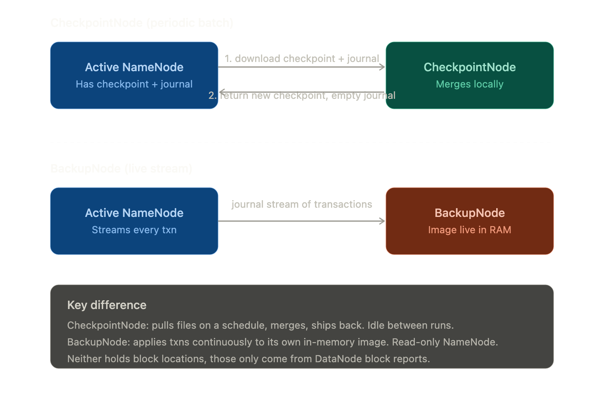
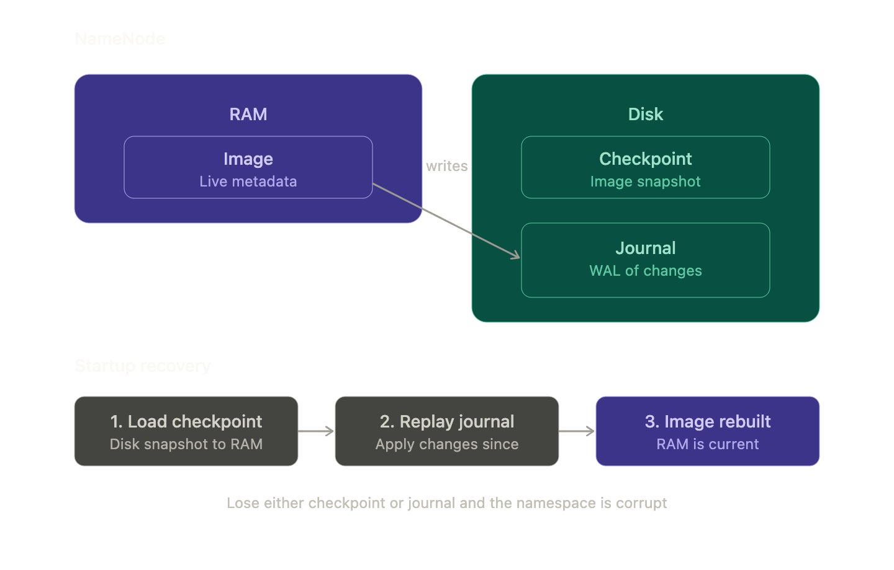
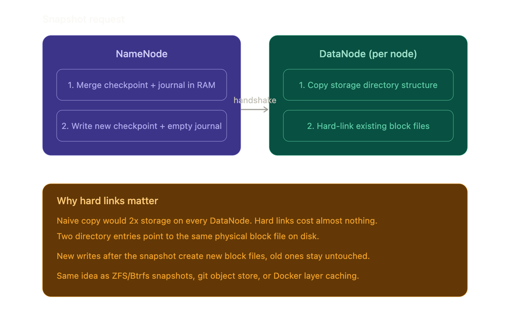
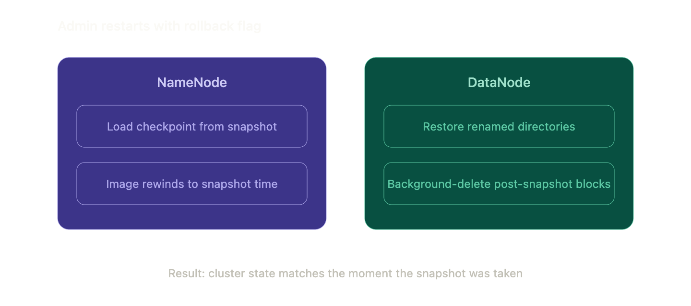

# HDFS

Distributed filesystem for the four **dimension** datasets
(`/landing`, `/curated`) and for every Spark batch output
(`/analytics/transactions_enriched`, `/analytics/customer_features`,
`/analytics/scored`). Transactions live in **Kafka, not HDFS** — see
[`docs/plans/dataflow.md`](../plans/dataflow.md). HDFS exists so
that (a) `dfs.replication` is a real thing the cluster exercises and
(b) Spark, Flink, and PrestoDB can all treat the dim + analytics
tables as durable input. Presto reaches them through the Hive
Metastore catalog (see [`presto.md`](presto.md)) rather than
path-based; the bytes still live here.

## Concepts

A short glossary of HDFS internals. Read before designing anything that
talks to the cluster — most of these terms show up in NameNode logs, the
web UI, and the dataflow plan.

**Core components**

- **NameNode**: Dedicated metadata server. Holds namespace tree +
  file-block-to-DataNode mapping in RAM. Directs clients to DataNodes
  for I/O.
- **DataNode**: Stores actual block data. Each replica = data file +
  metadata file (checksums + generation stamp). Sends block reports +
  heartbeats to NameNode.
- **HDFS Client**: Library apps use to talk to HDFS. Contacts NameNode
  for metadata, then reads/writes directly to DataNodes.
- **CheckpointNode**: Secondary NameNode role. Periodically downloads
  checkpoint + journal, merges them, returns new checkpoint. Keeps
  journal small.
- **BackupNode**: Like CheckpointNode but maintains an in-memory
  namespace image synced via journal stream from active NameNode.
  Effectively a read-only NameNode.

CheckpointNode (periodic batch) vs BackupNode (live journal stream) —
neither holds block locations; those only come from DataNode block
reports:



**Metadata concepts**

- **inode**: In-memory file/directory record on NameNode. Holds
  permissions, mod/access times, namespace, quotas (no block locations).
- **Image**: Full filesystem metadata, inodes + file-to-blocks mapping.
  Lives in NameNode RAM.
- **Checkpoint**: Persistent on-disk snapshot of the image. Replaced
  wholesale, never mutated in place.
- **Journal**: Write-ahead commit log of image changes. Replayed on
  checkpoint at startup. Replicated for durability.
- **Namespace ID**: Unique ID assigned to a filesystem instance,
  persisted on all nodes. Mismatched ID = node refused at handshake.
- **Storage ID**: DataNode's internal unique ID assigned at registration.
  Stable across IP changes.

The Image lives in NameNode RAM and writes are appended to the on-disk
Journal; the Checkpoint is a periodic snapshot of the Image. On startup,
the NameNode loads the Checkpoint, replays the Journal on top, and the
Image is current — lose either and the namespace is corrupt:



**Storage units**

- **Block**: Unit of file split. Default 128 MB, configurable.
  Independently replicated (default 3x).
- **Replica**: Copy of a block on a DataNode. Has its own generation
  stamp + checksum metadata.
- **Generation stamp**: Versioning identifier on a replica, used to
  detect stale replicas.
- **Checksum**: Per-block hash computed by client on write, verified by
  client on read. Mismatch → reported to NameNode, replica marked
  corrupt.

**Protocols / messages**

- **Handshake**: Startup protocol verifying namespace ID + software
  version between DataNode and NameNode. Mismatch → DataNode shuts down.
- **Block report**: DataNode → NameNode list of all replicas it holds
  (block ID, gen stamp, length). First sent at registration, then
  hourly.
- **Heartbeat**: DataNode → NameNode every 3s with capacity/usage stats.
  No heartbeat for 10 min → NameNode declares node dead.
- **Heartbeat reply**: NameNode piggybacks instructions (replicate,
  delete, re-register, shutdown, send block report).

**I/O model**

- **Single-writer, multiple-reader**: One writer at a time per file,
  many concurrent readers. Files are append-only, no in-place edits.
- **Lease**: Exclusive write grant tied to a client. Soft limit =
  exclusive window; hard limit = NameNode reclaims and closes file.
- **Write pipeline**: DataNodes chained to minimize network distance.
  Client streams 64 KB packets through the chain; next packet ships
  before prior ACK.
- **Read path**: Client gets replica locations from NameNode, sorted by
  distance, reads from closest. Falls back down the list on failure.

**Reliability / placement**

- **Block placement policy**: No DataNode holds >1 replica of a block;
  no rack holds >2 replicas of the same block (when enough racks
  exist).
- **Replication factor**: Per-file replica count, default 3,
  configurable.
- **Replication priority queue**: Under-replicated blocks queued by
  urgency (1 replica = highest priority).
- **Balancer**: Moves replicas from high-utilization DataNodes to
  low-utilization ones. Threshold (0,1) defines balance; bandwidth cap
  limits impact. Won't reduce replica/rack count; prefers intra-rack
  copy when possible.
- **Block Scanner**: Background job on each DataNode that re-verifies
  replica checksums against stored values. Logs verified time.
  Corruption → NameNode replicates a good copy first, then deletes
  corrupt one.
- **Decommissioning**: Marking a node for removal via excluded list.
  NameNode stops placing new replicas there and migrates existing ones
  off before safe removal.
- **Snapshot**: Point-in-time state of filesystem for rollback after
  upgrades. NameNode merges checkpoint+journal to new location;
  DataNodes hardlink existing block files (no data duplication).
- **Rollback**: Restart-with-flag that rewinds the cluster to a
  previous snapshot. NameNode loads the snapshotted checkpoint;
  DataNodes restore renamed directories and background-delete any
  blocks created after the snapshot. Result: cluster state matches the
  moment the snapshot was taken.
- **DistCp**: MapReduce-based tool for large parallel inter/intra-cluster
  copies. Each map task copies a slice; framework handles scheduling +
  recovery.

A snapshot is cheap because DataNodes hard-link existing block files
rather than copying them — same idea as ZFS/Btrfs snapshots, git
object store, or Docker layer caching:



Rollback is the read path on a snapshot: admin restarts with a rollback
flag, NameNode rewinds the image, DataNodes restore directory structure
and clean up any post-snapshot blocks:



**Rack awareness**

- **Rack**: Group of nodes sharing a switch. Intra-rack bandwidth >
  inter-rack. Drives placement policy and distance-based read ordering.

## Topology

| Service       | Image                          | Hostname     | Host → container ports | What other services talk to it       |
|---------------|--------------------------------|--------------|------------------------|--------------------------------------|
| `namenode`    | `farberg/apache-hadoop:3.4.1`  | `namenode`   | `9870→9870`, `9000→9000` | DataNodes, Spark master/workers, Flink job/task managers, Airflow tasks |
| `datanode-1`  | `farberg/apache-hadoop:3.4.1`  | `datanode-1` | (no host ports)        | NameNode (heartbeats); clients via NN-redirected reads/writes |
| `datanode-2`  | `farberg/apache-hadoop:3.4.1`  | `datanode-2` | (no host ports)        | NameNode (heartbeats); clients via NN-redirected reads/writes |

NameNode :9870 is the web UI; :9000 is the RPC port that
`fs.defaultFS=hdfs://namenode:9000` clients dial. DataNodes are
registered with the NameNode by hostname, with
`dfs.namenode.datanode.registration.ip-hostname-check=false` set in
[`hdfs-site.xml`](../../docker/hadoop-server/hdfs-site.xml) so the
container's bridge-network IPs don't trip up registration.

## Configuration source

Hadoop config is **bind-mounted XML**, not env-var-translated. The
upstream `apache/hadoop` image ships a translator that turns
`HDFS-SITE.XML_<key>=<value>` env vars into XML at startup; the
`farberg/apache-hadoop` arm64 fork does **not**. Rather than having
two config stories, every container in the stack reads XML directly:

| File                                                                      | Mounted into                                | Purpose                                              |
|---------------------------------------------------------------------------|---------------------------------------------|------------------------------------------------------|
| [`docker/hadoop-server/core-site.xml`](../../docker/hadoop-server/core-site.xml) | NN + DN-1 + DN-2 at `/opt/hadoop/etc/hadoop/` | `fs.defaultFS`, `hadoop.tmp.dir`                     |
| [`docker/hadoop-server/hdfs-site.xml`](../../docker/hadoop-server/hdfs-site.xml) | NN + DN-1 + DN-2 at `/opt/hadoop/etc/hadoop/` | replication, name/data dirs, NN address, perms off   |
| [`docker/hadoop-server/log4j.properties`](../../docker/hadoop-server/log4j.properties) | NN + DN-1 + DN-2                            | suppress the harmless `NativeCodeLoader` arm64 WARN  |
| [`docker/hadoop-client/core-site.xml`](../../docker/hadoop-client/core-site.xml)   | Spark master + workers + Flink jm/tm at `/opt/hadoop-conf/` | minimal client side: `fs.defaultFS=hdfs://namenode:9000` |
| [`docker/hadoop-client/hdfs-site.xml`](../../docker/hadoop-client/hdfs-site.xml)   | Spark master + workers + Flink jm/tm at `/opt/hadoop-conf/` | client-side block-access defaults                    |

When you change cluster-wide HDFS settings, edit the **server**
files and restart the affected NN/DN containers. The client-side
files are intentionally minimal — they exist only so Spark and Flink
know where the NameNode is via `HADOOP_CONF_DIR=/opt/hadoop-conf`.

`dfs.replication` is set to `2` (we run 2 DataNodes); the dataflow
plan calls for the audit-grade dim datasets (`fraud-reports`,
`customer-profiles`) to be written with replication `3` at write
time, which is enforced in the loader job, not cluster default.

## Volumes

| Volume         | Mount path             | What's persisted                | Wiped by `make nuke` |
|----------------|------------------------|---------------------------------|----------------------|
| `hdfs-name`    | NN: `/hadoop/dfs/name` | NameNode metadata (fsimage, edits) | yes               |
| `hdfs-data-1`  | DN-1: `/hadoop/dfs/data` | DataNode block storage          | yes                |
| `hdfs-data-2`  | DN-2: `/hadoop/dfs/data` | DataNode block storage          | yes                |

The NameNode bash entrypoint formats `/hadoop/dfs/name` only when it
doesn't already contain a `current/` subdirectory, so a normal
restart preserves the cluster ID and existing blocks. After
`make nuke`, the next bring-up formats fresh with cluster ID
`finpulse`.

## Healthcheck

NameNode only:

```yaml
test:     curl -fsS http://localhost:9870/ > /dev/null
interval: 10s
timeout:  5s
retries:  12
```

DataNodes have **no healthcheck** — they're declared
`depends_on: namenode (service_healthy)` so they only start once the
NN web UI is responsive, and their own liveness is observable via
the NN's "Datanodes" tab.

## Why this shape

- **`farberg/apache-hadoop:3.4.1` over `apache/hadoop:3.3.6`.** The
  official Apache image is amd64-only. On Apple Silicon it forces
  Rosetta/QEMU emulation that slows the JVM ~30–50%. The farberg
  fork rebuilds the same upstream Hadoop release natively for
  arm64+amd64, inherits the same entrypoint, and uses the same
  config layout. Trade-off: community image, single maintainer.
  Acceptable for a class project; revisit if Apache ever ships
  arm64 builds.
- **1 NN + 2 DN, not 1 NN + 1 DN.** With one DataNode, replication
  > 1 silently degrades to 1 (the NN can't put two replicas on the
  same DN). Two DataNodes means `dfs.replication=2` is actually
  enforced and we exercise replicated writes, which is part of what
  the project rubric grades.
- **`dfs.permissions.enabled=false`.** No Kerberos, no UID/GID
  alignment between containers and the host. Permissions-off keeps
  Spark workers (running as `root` to write event logs) and the
  Airflow tasks (running as the host UID) from tripping over
  ownership mismatches. Fine for a class project; in production this
  would be Kerberos + sentry/ranger.
- **Native-Hadoop WARN is suppressed.** arm64 has no `libhadoop.so`,
  so JVMs log `Unable to load native-hadoop library` on every start
  and fall back to pure-Java codecs. Functionally harmless. Silenced
  in [`docker/hadoop-server/log4j.properties`](../../docker/hadoop-server/log4j.properties)
  and [`docker/spark/log4j2.properties`](../../docker/spark/log4j2.properties).
  Comment those lines out temporarily if you're debugging a native-
  codec issue.

## Alternatives

Where HDFS sits in the broader landscape of distributed storage:

| System                         | Lineage                          | Pick instead when…                                                                                       |
|--------------------------------|----------------------------------|----------------------------------------------------------------------------------------------------------|
| **Amazon S3**                  | Cloud object store               | You're in AWS, want zero ops, can tolerate network latency. The default for greenfield data lakes.       |
| **MinIO**                      | Open-source S3-compatible        | You want S3 semantics on-prem or for local dev. Drop-in for any tool that speaks S3. Often the right modern pick over HDFS. |
| **Google Cloud Storage / Azure Blob** | Cloud object stores       | You're in GCP / Azure. Same shape as S3.                                                                 |
| **Ceph (RGW + CephFS + RBD)**  | Open-source distributed storage  | You want S3 + block + file from one cluster, and you have ops headcount.                                 |
| **Alluxio**                    | Caching/virtualization layer     | You want to front S3 with a hot tier, or unify HDFS + S3 under one namespace.                            |

**In 2026, HDFS is rarely the right pick for greenfield work** —
S3-compatible object storage has won. We use HDFS here because the
class rubric mandates the Hadoop ecosystem; in production, swap to
S3/MinIO and most of this stack (Spark, Flink, Pinot offline
segments, **and PrestoDB via the Hive connector's `s3a://`
reader**) keeps working with a one-line config change.

## Common commands

Run against the NameNode container — it ships the full Hadoop client.

```sh
docker compose exec namenode hdfs dfs -ls /
docker compose exec namenode hdfs dfs -mkdir -p /landing/customer-profiles
docker compose exec namenode hdfs dfs -put /tmp/foo.json /landing/customer-profiles/
docker compose exec namenode hdfs dfs -du -h /
```

Web UI: <http://localhost:9870>. The "Datanodes" tab is the fastest
way to confirm both DN's have registered.

```sh
make smoke-hdfs   # put / ls / cat / rm round-trip via the NN container
```

## Caveats

- **Don't put `transactions.csv.gz` in HDFS.** Per
  [`docs/plans/dataflow.md`](../plans/dataflow.md), transactions are
  Kafka-only. Spark batch-reads the topic by offset range and writes
  the *enriched* result back to `/analytics/transactions_enriched`,
  but there is no `/landing/transactions/` or
  `/curated/transactions/`.
- **NN format is one-shot.** The bash entrypoint runs `hdfs namenode
  -format` only if `/hadoop/dfs/name/current` is missing. If you
  ever need to re-format without `make nuke`, delete that directory
  inside the volume manually — naive image restarts won't do it.
- **Permissions are off.** Anything in HDFS is world-readable from
  inside the docker network. Don't put production credentials in
  here.
