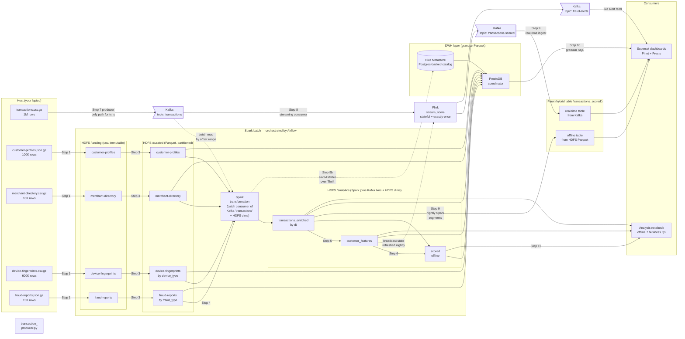

# Dataflow — end to end

This doc explains how the five raw datasets in `data/` move through the
stack and end up powering two consumers: an **analysis notebook**
(batch reader) and **Superset dashboards** (real-time + historical
reader, fed by Pinot). It complements [`plan.md`](plan.md) — the plan
tells you *what to build in what order*; this doc tells you *what data
is moving and why*.

The streaming layer follows the Robinhood
[Kafka → Flink → Kafka → Pinot](../odsc/robinhood_infrastructure.md)
pattern: Flink owns stateful, exactly-once scoring; Pinot owns
low-latency analytical serving via a **hybrid table** that unifies a
real-time copy (from Kafka) with a nightly Spark-reconciled offline
copy (from HDFS Parquet).

## Mental model: one Kafka topic, two consumers, one shared bridge

The fact stream (`transactions`) lives **only in Kafka**. The four
other datasets (customers, merchants, devices, fraud-reports) live
**only in HDFS** — they're slowly-changing dimensions, not events.
There is no `/landing/transactions/` or `/curated/transactions/`;
the producer publishes the `.csv.gz` straight to Kafka and that
topic *is* the system's record of truth for transactions.

Two consumers read the same Kafka topic for two purposes:

1. **Spark — batch consumer.** Nightly, Spark reads the
   `transactions` topic by offset range, joins each event against
   the four HDFS dimensions, and writes the enriched fact +
   customer-features + offline-scored outputs back to HDFS under
   `/analytics/`. These are the inputs to the offline analysis
   notebook *and* the source for Pinot's offline-table segments.
2. **Flink — streaming consumer.** Continuously, Flink reads the
   same topic, applies rules + a keyed velocity window, and writes
   to two more Kafka topics: `transactions-scored` (every event,
   feeds Pinot's real-time table) and `fraud-alerts` (risk ≥ 2,
   a live ticker for Superset).

The two consumer paths **meet** in two places:

- At the **customer_features Parquet**: Spark batch writes it;
  Flink broadcast-loads it. Without the batch path, Flink has no
  normal-behavior baseline to compare each event against.
- At the **Pinot hybrid table**: Flink writes the real-time copy
  via Kafka; nightly Spark writes the reconciled offline copy from
  HDFS. Superset queries the logical union — yesterday from the
  audit-grade reconciled offline segments, today from real-time.

```text
                                    transactions.csv.gz
                                            ↓
          customer / merchant /        Kafka producer
          device / fraud-report               ↓
              .gz files               Kafka 'transactions' (source of truth)
                  ↓                       ↓                 ↓
              /landing/             ┌─────┴─────┐       ┌───┴────┐
                  ↓                 │  Spark    │       │ Flink  │ ◄── broadcast state
              /curated/  ──────────►│  batch    │       │ scoring│     (customer_features)
                                    │ consumer  │       └───┬────┘
                                    └─────┬─────┘           │
                                          ↓                 ↓
                                /analytics/       Kafka 'transactions-scored'
                                transactions_enriched      'fraud-alerts'
                                          ↓                 ↓
                                /analytics/customer_features  Pinot real-time table
                                          ↓                 ↓
                                offline scoring             │
                                          ↓                 ↓
                                analysis notebook           │
                                          │                 │
                                          └──► Pinot offline table ◄── union ──► Superset
                                                (nightly Spark)
```

The arrow from `customer_features` into the Flink job is the
**bridge**. It's a one-time read at job startup (refreshed each
night when the Airflow batch DAG rebuilds the feature store); Flink
holds those ~100K rows in **broadcast state** on every task manager
so every event can be enriched without a network hop.

## Where the raw files come from

`data/*.gz` was produced by `scripts/generate_data.py` — a one-time
offline generator that synthesizes the five datasets with planted
fraud signals (seed `2041` for reproducibility). It is **not** a
runtime component: it runs once on the host, writes the gz files,
and is never invoked again. It is unrelated to the Kafka producer
in Step 7 (which will live at `src/producer/replay_transactions.py`).
Treat `generate_data.py` as sitting *before* the diagram below —
it's the upstream provider we pretend already gave us a 6-month
dump.

## End-to-end diagram

Two lanes flowing left → right. The top lane is the **Spark batch
path orchestrated by Airflow** (HDFS dim landing → curate →
transformation → analytics outputs). The bottom lane is the
**streaming path** (Kafka producer → Flink → Kafka). On the right
the data fans out to **two serving engines** — Pinot for
pre-aggregated streaming dashboards, PrestoDB-on-HMS for granular
ad-hoc SQL — and from there to Superset and notebooks.



**Two things to notice in this diagram:**

1. **`transactions` flows only through Kafka.** It is never landed in
   `/landing/transactions/` or curated to `/curated/transactions/`.
   Kafka topic `transactions` is the source of truth; replaying the
   producer is the only way a transaction gets into the system. The
   four other datasets (customers, merchants, devices, fraud-reports)
   still land in HDFS because they're slowly-changing dimensions or
   after-the-fact labels, not events.
2. **Both Spark and Flink subscribe to Kafka `transactions`.**
   - Spark reads in **batch mode** (`spark.read.format("kafka")` with
     starting + ending offsets) for nightly enrichment, feature-store
     rebuild, and Pinot offline segment generation.
   - Flink reads in **streaming mode** for sub-second scoring and
     event-time velocity windowing.
   This is the same "two consumers, one topic" shape the Robinhood
   talk shows on the high-level architecture slide.

Solid arrows are **events / files** moving. There are two dotted
arrows, both denoting "read once / read by snapshot, not a
continuous subscription":

- **`customer_features` ⇢ Flink** is **Flink broadcast state** —
  data does not flow through Kafka; Flink opens HDFS once on
  startup (refreshing nightly when the Airflow batch DAG rebuilds
  the feature store) and keeps it in operator state on every task
  manager.
- **Kafka `transactions` ⇢ Spark transformation** is the **batch
  read by offset range** — Spark consumes the topic in one pass per
  nightly run, the same way it would read a Parquet snapshot.

The Pinot box is a **hybrid table** (Robinhood pattern, slide #13):
the real-time path gives seconds-fresh data from Kafka, the offline
path is the nightly Spark-reconciled copy from HDFS, and the broker
unions them at query time — yesterday and earlier comes from the
reconciled offline segments, today comes from the real-time table.
Superset queries the logical hybrid table; it does not need to know
which physical path served any given row.

The **DWH box (HMS + PrestoDB)** is the second serving engine. It
reads the same `/curated/*` and `/analytics/*` Parquet that the
notebook reads, but routed through a *catalog* (HMS, dotted line
from Spark) rather than path-based access. Spark's `saveAsTable`
writes the bytes *and* registers the table in HMS in one call;
Presto discovers tables by querying HMS's Thrift API. Bytes still
live in HDFS — three concerns, three independent components:
storage, catalog, engine. See
[`docs/infrastructure/presto.md`](../infrastructure/presto.md) for
the wiring.

## Batch flow — walkthrough

```text
4 dim .gz files  ─►  /landing  ─►  /curated  ─┐
                       (Step 1)    (Step 3)   ▼
                                          Spark batch  ─►  /analytics  ─►  notebook
                                              ▲           (Steps 4-6)    (Step 12)
Kafka 'transactions'  ────────────────────────┘
                                          (batch read by offset, Step 4)
```

**What moves where:**

1. **`data/{customers,merchants,devices,fraud-reports}.gz` → `/landing`** *(Step 1, raw upload)*
   - The four dimension / fact-secondary files are copied as-is. `.gz`
     stays gzipped. No schema, no parse.
   - **`transactions.csv.gz` is NOT in this step.** It goes only to
     Kafka via the producer (Step 7). HDFS has no `/landing/transactions/`
     and no `/curated/transactions/`.
   - Replication 3 for `fraud-reports` and `customer-profiles`
     (audit + regulatory); replication 2 for the others.
   - **Why immutable.** If a downstream job corrupts data, we can
     always re-derive curated from landing. Landing is the
     source-of-record for what the upstream provider gave us — for
     dimensions. For transactions, that role belongs to the Kafka
     topic.

2. **`/landing` → `/curated`** *(Step 3, clean to Parquet)*
   - `device-fingerprints` partitioned by `device_type` (mobile /
     desktop / tablet) — a few queries split on this.
   - Dimensions (`customer-profiles`, `merchant-directory`) — no
     partitioning, they're small and always broadcast-joined.
   - `fraud-reports` partitioned by `fraud_type`.
   - **Why Parquet.** Columnar means we only read the columns we
     need; predicate pushdown means filters happen before
     deserialization; ~5–10× smaller than gzipped CSV.

3. **Kafka `transactions` + `/curated/*` → `/analytics/transactions_enriched`** *(Step 4)*
   - Spark batch job. The transaction side comes from Kafka:
     `spark.read.format("kafka").option("subscribe", "transactions")
     .option("startingOffsets","earliest").option("endingOffsets","latest")`.
     The dimension side comes from `/curated/*` Parquet.
   - Join: `transactions` LEFT JOIN devices LEFT JOIN fraud-reports,
     INNER JOIN broadcast(customers + merchants). Adds the label
     column `confirmed_fraud`.
   - **Why LEFT for some, INNER for others.** Devices and
     fraud-reports are sparse — not every txn has a fingerprint, and
     only ~2% have a fraud report. Customers and merchants are
     guaranteed (referential integrity in the generator).
   - **Label leakage warning.** `fraud_reports.timestamp` happens
     *after* the txn — useful for the batch label, dangerous if you
     ever feed it to a model as a feature. The streaming flow never
     sees this column.
   - **Why batch-read Kafka instead of file-read the gz.** Kafka is
     the single source of truth for transactions. If batch read the
     `.gz` directly, two consumers would see two different versions
     when the stream had drift, late events, or replays.

4. **`/analytics/transactions_enriched` → `/analytics/customer_features`** *(Step 5)*
   - One row per `card_id`. Aggregates: avg/stddev/p95 amount, txn
     count, distinct merchants/countries, plus static fields from
     customer-profiles (home country, monthly spend).
   - **This is the feature store.** It is small (~100K rows, a few
     MB Parquet), self-contained, and PII-light. It's the bridge to
     streaming.

5. **`/analytics/scored` → notebook** *(Steps 6, 12)*
   - Offline scoring applies rules + (optional) ML to the enriched
     fact and writes per-txn predictions.
   - The notebook reads `/analytics/*` directly via PySpark to
     answer the 7 business questions in `docs/scenario.md`.

## Streaming flow — walkthrough

```text
transactions.csv.gz  ─►  Kafka 'transactions'  ─►  Flink scoring  ─►  Kafka 'transactions-scored' ─► Pinot real-time
   (host file)            (Step 7 producer)        (Step 8 job)            (Step 9 ingest)            ↓
                                                        │                                       Superset
                                                        └──► Kafka 'fraud-alerts' ──────────────────►
```

**What moves where:**

1. **`transactions.csv.gz` → Kafka topic `transactions`** *(Step 7, producer)*
   - A small Python script reads the gz file row-by-row and publishes
     each row as a JSON value, **keyed by `card_id`**.
   - **Why key by `card_id`.** Same key → same partition → guaranteed
     ordering. Velocity rules ("5 txns in 10 minutes from the same
     card") need this. If you partition randomly, two txns from the
     same card can land on different partitions, be processed by
     different consumer instances, and your window state splits.
   - The same partition key flows all the way through to Pinot
     (matching Robinhood's "partition by PK in Kafka and Pinot — same
     hash" guidance from the upserts slide), so a card's history
     stays on one Pinot server segment.
   - Replay rate is a CLI flag (`--rate 200`). The dataset spans 6
     months; we're not waiting that long.
   - **Only `transactions` is replayed.** Customer profiles,
     merchant directory, device fingerprints, fraud reports do
     **not** flow through Kafka. They are static (or
     after-the-fact) and live in HDFS only.

2. **Kafka `transactions` → Flink scoring app** *(Step 8)*
   - The streaming job is a long-lived **Flink** application
     (`src/consumer/stream_score/`). Flink, not Spark Structured
     Streaming, because:
     - **Event-time native** — windowing on the txn `timestamp`, not
       wall-clock arrival. Late events are routed to a side output
       for offline correction in Spark, exactly as the Robinhood talk
       prescribes.
     - **Exactly-once via two-phase commit with Kafka** — no duplicate
       scores written to `transactions-scored` even if a task manager
       restarts mid-batch.
     - **Sub-second latency** — true streaming, not micro-batches.
   - On startup the job does **two reads from HDFS, once** (refreshed
     nightly when the batch DAG rebuilds them):
     - `/analytics/customer_features/` → broadcast state
     - `/curated/merchant-directory/` → broadcast state
   - Per event:
     - Parse the JSON value into a typed record.
     - Look up the broadcast feature row for this `card_id`.
     - Apply rule columns (high amount, intl mismatch, VPN+unknown
       device, high-risk merchant).
     - Compute the **velocity rule** as a keyed event-time window
       (`keyBy(card_id).window(SlidingEventTimeWindows.of(10 min, 1
       min))`) — this is genuinely stateful, Flink holds counters in
       RocksDB and checkpoints them.
     - Compute `risk_score` (sum of triggered rules) and
       `recommended_action` (review / block).
   - **Watermark** of `event_time − 2 min` defines the on-time
     boundary; events past it go to a side output that Spark
     reconciles into the offline Pinot table at night.

3. **Flink → Kafka topics `transactions-scored` and `fraud-alerts`**
   - Every txn gets a record on `transactions-scored` (full audit
     trail; this is the topic Pinot's real-time table consumes).
   - Only txns with `risk_score >= 2` go to `fraud-alerts` (Superset
     can tail this for a live alert ticker; ops tools can subscribe
     directly without going through Pinot).
   - Both writes participate in the same Flink checkpoint, so the
     two topics never disagree about whether a given txn was seen.

4. **Kafka `transactions-scored` → Pinot real-time table** *(Step 9)*
   - Pinot's server tails the Kafka topic directly — no Spark, no
     Flink in between. Each consuming segment builds an in-memory
     row-store index; once it hits the size threshold it's sealed
     into a columnar, fully-indexed segment on disk and uploaded to
     deep store.
   - Same Pinot table is **hybrid**: alongside the real-time path,
     nightly Spark builds offline segments from
     `/analytics/transactions_enriched/` and uploads them. The Pinot
     broker picks offline segments for any time before the cutover,
     real-time segments for everything after.

5. **Pinot → Superset** *(Step 10)*
   - Superset connects to Pinot via SQLAlchemy (`pinotdb` driver,
     already wired in `docker/superset/requirements-local.txt`).
     Charts written against the hybrid table get fresh data from the
     real-time path and audit-grade reconciled data from the offline
     path automatically.
   - Suggested dashboards: live fraud rate by merchant category
     (real-time-leaning), false-positive rate per rule (offline-
     leaning, needs the `confirmed_fraud` label), and an alert
     ticker driven straight off `fraud-alerts`.

## The bridge: customer_features Parquet

This deserves its own callout because it's the part most students
under-appreciate.

```text
            HDFS                                 Kafka
       /analytics/customer_features/         topic: transactions
                |                                   |
                | (read at startup +                | (consumed continuously)
                |  reloaded each night)             |
                ▼                                   ▼
          ┌─────────────────────────────────────────────┐
          │             Flink scoring job               │
          │  - broadcast state of customer_features     │
          │  - lookup each incoming txn against it      │
          │  - keyed sliding window for velocity rule   │
          │  - compute risk_score, exactly-once         │
          └─────────────────────────────────────────────┘
                                |
                                ▼
            Kafka: transactions-scored, fraud-alerts
                                |
                                ▼
                       Pinot real-time table
                                |
                                ▼
                      Superset dashboards
```

**Why broadcast state and not stream-stream join?**

- Customer features are slowly changing (we rebuild daily in the
  Airflow batch DAG). They don't need event-time semantics.
- 100K rows × ~30 columns is small (~5–10 MB). It fits comfortably
  in each task manager's broadcast state and ships once at startup.
- A stream-stream join would need watermarks on both sides and
  state management for both. Robinhood's "Where joins really belong"
  slide warns that stream-stream joins double state size and the
  watermark drops to the slowest source — both are wrong here, since
  the customer-features stream isn't really a stream.

**What if features go stale?**

- They will, between daily batch runs. That's accepted — fraud
  patterns don't shift hour-to-hour at the customer-baseline level.
- Production would use a feature-store service (Feast, Tecton)
  that supports point-in-time correct lookups. Out of scope here.

**Restart implications.**

- When you restart the Flink job, the broadcast state is re-read
  from whatever's at `/analytics/customer_features/` *at restart
  time*. So if the daily batch updated the features at 02:00,
  restarting the job at 02:30 picks them up. No code change needed.
- Flink checkpoints store the *event-time* watermarks and velocity
  window state, so a restart resumes scoring without dropping or
  duplicating events on `transactions-scored`.

## What is *not* in either flow

A few things that look like they "should" be in the diagram but
aren't, deliberately:

- **Transactions are not in HDFS.** No `/landing/transactions/`, no
  `/curated/transactions/`. The Kafka topic is the system's single
  source of truth for the transaction fact stream. Both batch (Spark)
  and streaming (Flink) consumers read from it. The transactions only
  appear in HDFS *after* enrichment — `/analytics/transactions_enriched/`
  is a Spark output that joins Kafka events with curated dimensions.
- **There is no Kafka → HDFS mirror sink.** Some real pipelines copy
  every Kafka event back to HDFS for replay. We don't — Spark batch
  reads Kafka directly via offset ranges, so a separate mirror would
  be redundant. The `transactions` topic is configured with long
  retention so replay-from-the-beginning still works.
- **Fraud reports do not feed the streaming job.** They arrive
  *after* a fraud is reported (often days later). The streaming job
  is making predictions in real time — it cannot use labels that
  don't exist yet. Fraud reports flow into the batch label column
  (`confirmed_fraud`) and are used for offline evaluation only.
- **Device fingerprints are not a separate Kafka topic.** They're
  part of the transaction event in the streaming flow. The producer
  reads `transactions.csv.gz`, which already has `device_id` and
  related fields per row; the device-fingerprints CSV adds richer
  device metadata that we use *in the batch enrichment* but not
  per-event in streaming. (You could extend it: have the streaming
  job broadcast-load `/curated/device-fingerprints/` too. Worth
  considering once Step 8 works.)

## How a single transaction travels

To make it concrete, follow one row from `data/transactions.csv.gz`:

1. **Step 7 — into Kafka.** The producer reads the row from the gz
   file and publishes it to Kafka topic `transactions`, keyed by
   `card_id`. This is the *only* place the transaction enters the
   system. There is no HDFS landing or curate stage for txns.
2. **Step 8 — Flink consumes (streaming).** Within seconds, the Flink
   job sees the event, looks up the broadcast customer-features
   state, applies the rules + sliding-window velocity, computes a
   risk score, and — inside one Flink checkpoint — writes a record
   to `transactions-scored` (always) and `fraud-alerts` (if
   `risk_score >= 2`).
3. **Step 9 — Pinot ingests in real-time.** Pinot's server tails
   `transactions-scored` and the row appears in the real-time table
   within seconds. Superset (Step 10) sees it on any dashboard
   scoped to "today" — the broker is reading the real-time path.
4. **Tonight — Spark consumes (batch).** The nightly Airflow DAG
   triggers Spark, which reads the same Kafka topic
   (`transactions`) by offset range, joins against `/curated/*`
   dims, and writes `/analytics/transactions_enriched/dt=...`,
   then `/analytics/customer_features/` and `/analytics/scored/`
   (Steps 4–6). Same Spark job builds Pinot offline segments and
   uploads them — the broker switches that day to the offline path
   automatically, and any late-arriving events sent to Flink's side
   output get folded in.
5. **Step 12 — notebook.** The analysis notebook reads
   `/analytics/*` directly via PySpark to answer the 7 business
   questions. It compares predicted vs confirmed fraud and
   contributes to the "top-fraud-features" chart.

Same row, two completely different consumers reading the same Kafka
topic, two different latency profiles, one shared feature definition,
one shared query surface in Superset. That's the design.

## Three serving layers, three access patterns

These are not redundant. Each answers a different kind of question:

- **Notebook (offline, deep)** — *"across the full 6 months, which
  features predict fraud best? What's the PR-AUC of rule_velocity
  vs rule_high_amount? How does fraud rate vary by customer
  segment?"* This needs full-fidelity historical data, custom
  Python, and the freedom to iterate on charts. Reads
  `/analytics/scored/` and `/analytics/customer_features/` directly
  via PySpark.
- **Superset on Pinot (live, broad)** — *"what's the fraud rate
  this hour by merchant category? Are alert volumes spiking right
  now? What's the false-positive rate trending over the last 7
  days?"* This needs sub-second latency at high concurrency, fixed
  dashboard definitions, and seconds-fresh data. Reads the Pinot
  hybrid table — pre-aggregated, columnar, segment-indexed.
- **Superset on PrestoDB (granular, ad-hoc)** — *"show me every
  transaction over $10K from device fingerprint X during March,
  joined to merchant category and customer tenure"*. This needs
  full row detail and arbitrary multi-table joins, but at SQL Lab
  pace (seconds, not sub-second). Reads HDFS Parquet under
  `/curated/*` and `/analytics/*` via the Hive Metastore catalog —
  same data as the notebook, but accessible from Superset's SQL
  editor and chart builder. See
  [`docs/infrastructure/presto.md`](../infrastructure/presto.md).

Robinhood's "dashboard experience changed dramatically" slide is
about *swapping Presto for Pinot* on the canned-dashboard layer —
Looker/Presto on a Hadoop warehouse → Superset on Pinot took
dashboard p95 from 58s to 800ms and freshness from T+24h to ~5s. We
honour that lesson: Pinot owns canned dashboards. But Presto is back
in the stack for the *granular ad-hoc* role it's actually best at —
slicing raw rows from the data lake without a fixed schema. Two
different jobs, two engines, one data lake.

## See also

- [`plan.md`](../plan.md) — step-by-step build order
- [`docs/scenario.md`](scenario.md) — what we're building and why
- [`docs/infrastructure/`](../infrastructure/index.md) — how each service is wired
