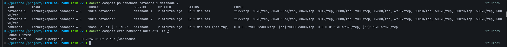
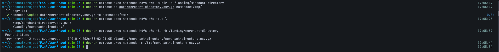
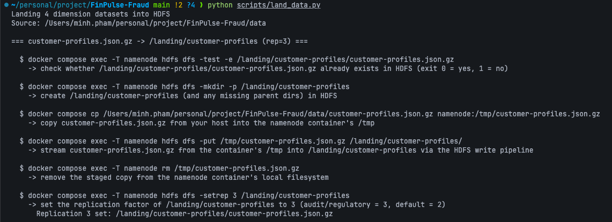
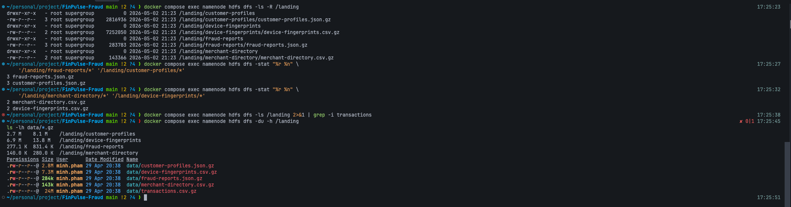

# Step 1 — Land the dimension datasets into HDFS

This step gets the four dimension `.gz` files from
[`data/`](../../data/) into `/landing/<dataset>/` on HDFS,
**byte-for-byte unchanged**. The `/landing` zone is the immutable
record of what the upstream provider gave us — no transforms, no
schema changes, no flattening. Audit, reruns, and "we got the source
file wrong" investigations all start by reading from `/landing`.

This is the sister doc to
[`docs/plans/plan.md` § Step 1](../plans/plan.md#step-1--land-the-dimension-datasets-into-hdfs)
— the plan defines the rubric, this doc is the runbook.

## What this step delivers

| Source file | Lands at | Replication |
|---|---|---|
| `data/customer-profiles.json.gz` (2.8 MB) | `/landing/customer-profiles/` | 3 (regulatory) |
| `data/device-fingerprints.csv.gz` (7.3 MB) | `/landing/device-fingerprints/` | 2 (default) |
| `data/fraud-reports.json.gz` (284 KB) | `/landing/fraud-reports/` | 3 (audit) |
| `data/merchant-directory.csv.gz` (143 KB) | `/landing/merchant-directory/` | 2 (default) |

`fraud-reports` and `customer-profiles` get replication 3 because
they're audit / regulatory grade; the other two stay at the cluster
default of 2 (we run 2 DataNodes, so 2 is also the practical maximum
for those).

## What this step does NOT do

- **`transactions.csv.gz` is not landed.** Per
  [`docs/plans/dataflow.md`](../plans/dataflow.md), transactions are a
  Kafka-only stream — both Spark batch (Step 4) and Flink stream
  (Step 7) consume from Kafka topic `transactions`. There must be no
  `/landing/transactions/` and no `/curated/transactions/` after this
  step.
- **No Parquet conversion.** Schema changes / partitioning / column
  derivation are **Step 2 (Curate)**. Step 1 keeps the bytes verbatim.
- **No replication on the empty parent dir.** `setrep` is applied
  per-dataset directory, not on `/landing` itself — `/landing` is
  just a namespace, no blocks of its own.

## Concepts you'll meet here

- **HDFS zone pattern** — `/landing` is the immutable raw zone,
  `/curated` is the cleaned/parqueted zone (Step 2), `/analytics` is
  for derived outputs (Step 4 onwards). Audits + reruns require the
  original bytes to still exist; the zone separation is what makes
  that work.
- **Per-file replication factor.** The cluster default is 2 (set in
  [`hdfs-site.xml`](../../docker/hadoop-server/hdfs-site.xml)).
  `hdfs dfs -setrep N <path>` raises or lowers replication on a
  single file or directory; the change is queued through the
  *replication priority queue* and picked up asynchronously by the
  NameNode (see
  [`hdfs.md` § Concepts](../infrastructure/hdfs.md#concepts)).
- **The write pipeline.** When you `put` a file, the client asks the
  NameNode for replica locations, then streams 64 KB packets through
  a chain of DataNodes. You don't do anything special — but knowing
  this is what's happening makes "why did one DN's disk fill faster?"
  concrete later (answer: the balancer hasn't run).
- **Idempotency.** A Step 1 loader script must be re-runnable: if
  `/landing/foo/foo.gz` already exists, skip the `put` rather than
  duplicating or failing. Audit zones are append-only by intent —
  re-running today's load shouldn't double the bytes.

## Pre-flight

Confirm HDFS is up and `/landing` is empty:

```sh
docker compose ps namenode datanode-1 datanode-2
# All three should be Up. namenode should be (healthy).

docker compose exec namenode hdfs dfs -ls /
# Should show /warehouse (HMS) but no /landing yet.
```

You should see all three containers `Up` with `namenode` reporting
`(healthy)`, and `/` containing only `/warehouse` (the Hive
Metastore's directory; not ours):



If anything is missing:

```sh
make up-core   # HDFS + Spark + Kafka, skipping Airflow
```

## 1a — Manual round-trip on one file

Before writing any script, do **one file by hand** so you see each
command land. Use `merchant-directory.csv.gz` (143 KB — the smallest).

### Reading the commands

Every command below has the same shape. Once you can read it, the
rest of this step is just substitution:

```text
docker compose exec  namenode   hdfs dfs   -mkdir -p   /landing/merchant-directory
└────────┬─────────┘ └───┬───┘  └───┬───┘  └────┬────┘ └─────────────┬─────────────┘
   run a command       which       Hadoop's   subcommand       HDFS path inside
   inside a running   container    filesystem  (-mkdir, -put,    the cluster
   container          (the docker  CLI         -ls, -rm, …)
                      compose
                      service
                      name)
```

In plain English:

- **`docker compose exec <service>`** — run something inside an
  already-running container. Like SSH-ing into the box, but no SSH
  daemon needed. `<service>` is the service name from
  [`docker-compose.yml`](../../docker-compose.yml). We use `namenode`
  because that container ships a full Hadoop client.
- **`hdfs dfs`** — Hadoop's distributed-filesystem CLI. Same idea as
  `aws s3` for S3 or `gsutil` for GCS — a command-line interface to a
  remote filesystem. It contacts the NameNode on
  `hdfs://namenode:9000` (configured in
  [`core-site.xml`](../../docker/hadoop-server/core-site.xml)) and
  routes the actual byte transfer through whichever DataNodes the NN
  picks.
- **Subcommands** map to their Unix cousins:
  `-mkdir`, `-ls`, `-rm`, `-cp`, `-put`, `-cat`, `-du`. Flags too:
  `-p` (create parent dirs), `-h` (human-readable sizes), `-R`
  (recursive).
- **`docker compose cp <local> <service>:<path>`** — the
  docker-compose flavour of `scp`. Copies a file *between your host
  and a container* (not into HDFS — that's `-put`'s job). We need
  this because the namenode container has no view of your local
  `data/` directory; the pattern is: stage into `/tmp` inside the
  container, then `hdfs dfs -put` it from there.

### The five commands

```sh
# 1. Create the per-dataset directory in HDFS.
docker compose exec namenode hdfs dfs -mkdir -p /landing/merchant-directory

# 2. Copy the local file into the namenode container's /tmp.
docker compose cp data/merchant-directory.csv.gz namenode:/tmp/

# 3. Stream it from the container's /tmp into HDFS.
docker compose exec namenode hdfs dfs -put \
    /tmp/merchant-directory.csv.gz \
    /landing/merchant-directory/

# 4. Verify it landed at replication 2.
docker compose exec namenode hdfs dfs -ls -h /landing/merchant-directory

# 5. Tidy up the staging copy inside the container.
docker compose exec namenode rm /tmp/merchant-directory.csv.gz
```

What you should see — note the `2` in the `-ls` output (that's the
replication factor) and the size `140.0 K`:



If 1a worked, you've now got `/landing/merchant-directory/` with one
file at replication 2. Don't manually do the other three — the
script in 1b takes over and is idempotent (it skips files that
already exist, so re-landing `merchant-directory` is a no-op).

## 1b — Idempotent loader script

`scripts/land_data.py` runs on the **host** (not inside a container). It
drives the HDFS CLI through `docker compose exec`, stages local files
through `docker compose cp`, and uses `hdfs dfs -test -e` for the
idempotency check.

Why a host-side driver instead of a script-inside-the-namenode? The
namenode container has no view of `data/`. We could bind-mount it,
but that's a docker-compose change for one job. The wrapper-from-host
approach keeps the compose file untouched and makes the staging step
visible.

```python
"""Land the four dimension datasets into /landing/ on HDFS.

Idempotent: re-running is a no-op if the file is already in HDFS at
the right path. Replication is re-applied every run (cheap, idempotent).

Verbose by design — every shell command is printed before it runs,
along with a short explanation of what it does. The goal is to make
the HDFS landing flow legible while you're learning the moving parts.

Run from the repo root:
    python scripts/land_data.py
"""
from __future__ import annotations

import shlex
import subprocess
import sys
from pathlib import Path

REPO_ROOT = Path(__file__).resolve().parent.parent
DATA_DIR = REPO_ROOT / "data"

# (local filename, hdfs landing dir, replication factor)
DATASETS = [
    ("customer-profiles.json.gz",   "/landing/customer-profiles",   3),
    ("device-fingerprints.csv.gz",  "/landing/device-fingerprints", 2),
    ("fraud-reports.json.gz",       "/landing/fraud-reports",       3),
    ("merchant-directory.csv.gz",   "/landing/merchant-directory",  2),
]


def run(cmd: list[str], why: str, *, check: bool = True) -> subprocess.CompletedProcess:
    """Run a shell command, printing the command and its purpose first."""
    print()
    print(f"  $ {shlex.join(cmd)}")
    print(f"    -> {why}")
    result = subprocess.run(cmd, check=check, capture_output=True, text=True)
    if result.stdout.strip():
        for line in result.stdout.rstrip().splitlines():
            print(f"      {line}")
    return result


def nn(*args: str, why: str) -> subprocess.CompletedProcess:
    """Run a command inside the namenode container."""
    return run(["docker", "compose", "exec", "-T", "namenode", *args], why)


def hdfs_exists(path: str) -> bool:
    """Return True if `path` exists in HDFS."""
    result = run(
        ["docker", "compose", "exec", "-T", "namenode",
         "hdfs", "dfs", "-test", "-e", path],
        why=f"check whether {path} already exists in HDFS (exit 0 = yes, 1 = no)",
        check=False,
    )
    return result.returncode == 0


def land(filename: str, hdfs_dir: str, rep: int) -> None:
    local = DATA_DIR / filename
    if not local.exists():
        sys.exit(f"missing local file: {local}")

    hdfs_path = f"{hdfs_dir}/{filename}"

    if hdfs_exists(hdfs_path):
        print(f"\n  [skip] {hdfs_path} already exists in HDFS")
    else:
        nn("hdfs", "dfs", "-mkdir", "-p", hdfs_dir,
           why=f"create {hdfs_dir} (and any missing parent dirs) in HDFS")
        run(
            ["docker", "compose", "cp",
             str(local), f"namenode:/tmp/{filename}"],
            why=f"copy {filename} from your host into the namenode container's /tmp",
        )
        nn("hdfs", "dfs", "-put", f"/tmp/{filename}", hdfs_dir + "/",
           why=f"stream {filename} from the container's /tmp into {hdfs_dir} via the HDFS write pipeline")
        nn("rm", f"/tmp/{filename}",
           why="remove the staged copy from the namenode container's local filesystem")

    # setrep is idempotent — safe to re-apply on every run.
    nn("hdfs", "dfs", "-setrep", str(rep), hdfs_dir,
       why=f"set the replication factor of {hdfs_dir} to {rep} (audit/regulatory = 3, default = 2)")


def main() -> None:
    print(f"Landing {len(DATASETS)} dimension datasets into HDFS")
    print(f"Source: {DATA_DIR}")
    for filename, hdfs_dir, rep in DATASETS:
        print(f"\n=== {filename} -> {hdfs_dir} (rep={rep}) ===")
        land(filename, hdfs_dir, rep)
    print("\nDone.")


if __name__ == "__main__":
    main()
```

Run it:

```sh
python scripts/land_data.py
```

Each command is printed before it runs, with a short `->` line
explaining what it does, and any captured stdout indented underneath.
On a re-run, every dataset hits the `[skip]` branch (the file
already exists in HDFS) and only the `setrep` calls fire — a quick
sanity loop that the audit/regulatory replication is still 3.

What a fresh run looks like for one dataset (the full
test → mkdir → cp → put → rm → setrep sequence, with each command's
purpose printed inline):



## Verification

Run all five checks. The first three are the rubric; the last two
are sanity.

```sh
# 1. Tree of /landing — expect 4 dirs, each with one .gz.
docker compose exec namenode hdfs dfs -ls -R /landing

# 2. Replication on the regulatory datasets — expect 3.
#    Note: quote the wildcards so the shell doesn't try to glob them
#    locally (zsh errors with `no matches found` otherwise). HDFS
#    expands them server-side.
docker compose exec namenode hdfs dfs -stat "%r %n" \
    '/landing/fraud-reports/*' '/landing/customer-profiles/*'

# 3. Replication on the non-regulatory datasets — expect 2.
docker compose exec namenode hdfs dfs -stat "%r %n" \
    '/landing/merchant-directory/*' '/landing/device-fingerprints/*'

# 4. Confirm transactions are NOT in HDFS — expect empty output.
docker compose exec namenode hdfs dfs -ls /landing 2>&1 | grep -i transactions

# 5. Sizes match the local files (bytes-in == bytes-out).
docker compose exec namenode hdfs dfs -du -h /landing
ls -lh data/*.gz
```

All five checks running back-to-back: each `.gz` lands at the right
path, regulatory datasets show replication `3`, others show `2`,
no `transactions` directory exists, and sizes match the local files
in `data/`:



A second visual check: open the NameNode web UI at
<http://localhost:9870> → **Utilities** → **Browse the file system**
→ `/landing/`. You can click into each subdirectory and inspect
block locations.

### What "passes" looks like

```text
$ docker compose exec namenode hdfs dfs -ls -R /landing
drwxr-xr-x   - root supergroup   /landing/customer-profiles
-rw-r--r--   3 root supergroup   /landing/customer-profiles/customer-profiles.json.gz
drwxr-xr-x   - root supergroup   /landing/device-fingerprints
-rw-r--r--   2 root supergroup   /landing/device-fingerprints/device-fingerprints.csv.gz
drwxr-xr-x   - root supergroup   /landing/fraud-reports
-rw-r--r--   3 root supergroup   /landing/fraud-reports/fraud-reports.json.gz
drwxr-xr-x   - root supergroup   /landing/merchant-directory
-rw-r--r--   2 root supergroup   /landing/merchant-directory/merchant-directory.csv.gz
```

The leading number on the `-rw-r--r--` lines is the replication
factor; 3 for the regulatory two, 2 for the others.

## Troubleshooting

- **`docker compose cp` fails with `no such service`.** You're not
  in the repo root. `cd` to the directory containing
  `docker-compose.yml`.
- **`-put` says `file already exists`.** The script's `[skip]` branch
  should prevent this; if it shows up, either `hdfs dfs -rm` the
  existing file or pass `-f` to `put`. Don't add `-f` to the loader
  — it defeats idempotency.
- **`-setrep` succeeds but DataNode disk usage doesn't match.**
  setrep enqueues replication asynchronously through the priority
  queue; check the NN web UI's **Under-Replicated Blocks** row. On
  a 2-DN cluster with files this small, it usually clears in a few
  seconds.
- **Replication shows 1, not 2.** One DataNode is down — check
  `docker compose ps`. With only one DN, the NN can't satisfy
  replication ≥ 2 and silently degrades.
- **`hdfs dfs -test -e` returns nonzero.** That's expected — `-test`
  uses exit codes, not output. The `hdfs_exists()` helper handles
  this.

## What's next

Step 2 (Curate) reads from `/landing/`, converts each `.gz` to
partitioned Parquet, and writes to `/curated/`. Don't start Step 2
until every check above passes.
