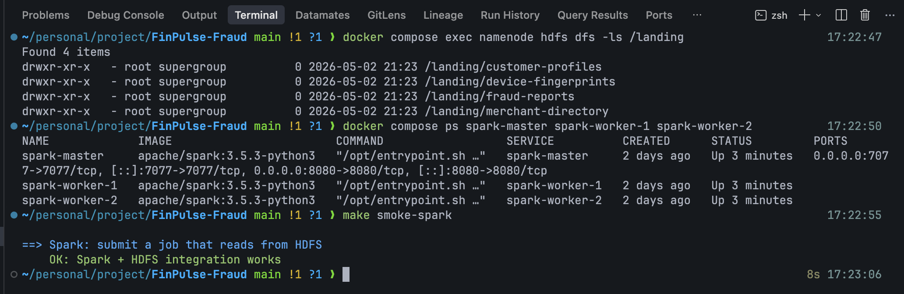
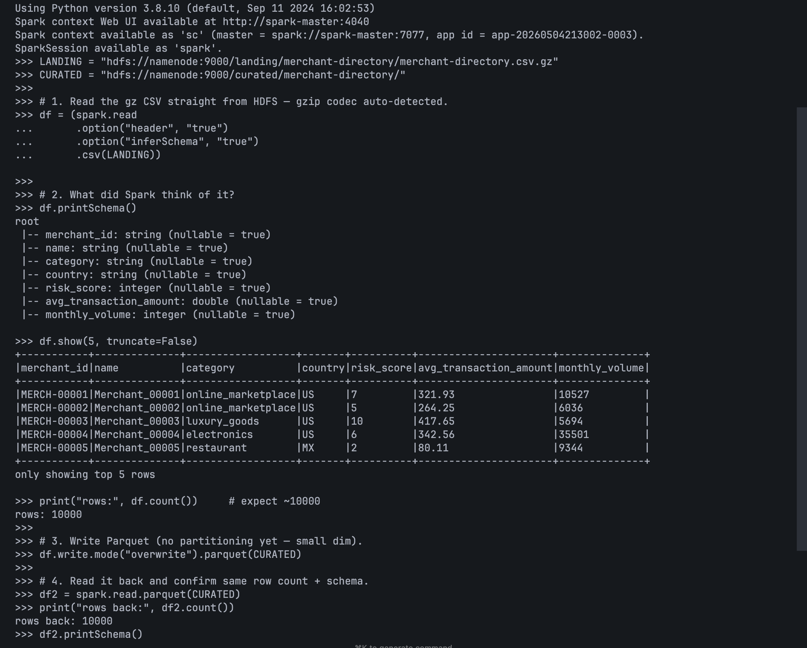
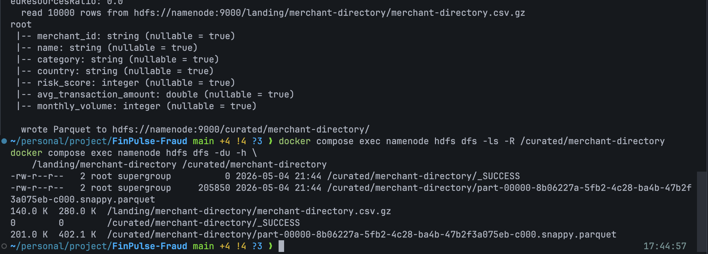

# Step 2 — Curate the dimension datasets

This step takes the four `.gz` files Step 1 landed in `/landing/` on
HDFS, parses them with Spark, and writes the result as Parquet to
`/curated/<dataset>/` — partitioned where it makes sense, untouched
otherwise. **Schema cleanup, not joins.** Joins and feature
engineering are Step 4 onward.

This is the sister doc to
[`docs/plans/plan.md` § Step 2](../plans/plan.md#step-2--curate-the-dimension-datasets)
— the plan defines the rubric, this doc is the runbook.

## What this step delivers

Every output is **Snappy-compressed Parquet** under `/curated/<dataset>/`.
The table below summarises which input format each row starts from
and what's partition-worthy:

| Source (from Step 1)                                           | Output (always Parquet)           | Partitioned by | Input quirk                                          |
|----------------------------------------------------------------|-----------------------------------|----------------|------------------------------------------------------|
| `/landing/merchant-directory/merchant-directory.csv.gz`        | `/curated/merchant-directory/`    | none (10K rows, single Parquet file) | gzip CSV → Parquet                          |
| `/landing/device-fingerprints/device-fingerprints.csv.gz`      | `/curated/device-fingerprints/`   | `device_type` (mobile / desktop / tablet) | gzip CSV → Parquet                          |
| `/landing/customer-profiles/customer-profiles.json.gz`         | `/curated/customer-profiles/`     | none           | gzip JSON-array → Parquet; needs `multiLine=true`; `typical_categories` stays as `array<string>` |
| `/landing/fraud-reports/fraud-reports.json.gz`                 | `/curated/fraud-reports/`         | `fraud_type`   | gzip JSON-array → Parquet; needs `multiLine=true` |

**Don't expect the Parquet output to be dramatically smaller than the
landing `.gz`.** gzip is a strong general-purpose compressor; on
narrow tables Snappy-Parquet often comes in **about the same size or
slightly larger**, and only wins on wide tables with highly repetitive
columns. **File size isn't why we're moving to Parquet here** — the
wins are downstream (see *Concepts → Why Parquet, not gzip-CSV/JSON*
below). Steps 4, 8, and 9 are all easier *because* the data is
Parquet, regardless of whether it shrunk.

## What this step does NOT do

- **No catalog registration.** No `saveAsTable`, no HMS, no Presto
  visibility. That's [Step 9](../plans/plan.md#step-9--register-the-granular-hive-tables-for-presto)
  — keeping it separate is deliberate so the catalog-vs-storage-vs-engine
  split lands clean later.
- **No joins, no feature engineering, no derived columns.**
  Step 4 reads `/curated/` + Kafka `transactions` and produces
  `/analytics/transactions_enriched/`.
- **No transactions.** Per
  [`docs/plans/dataflow.md`](../plans/dataflow.md), `transactions` is a
  Kafka-only stream — it never lives in `/landing` or `/curated`. After
  Step 2, `/curated/` should hold exactly four directories.
- **No explicit `StructType` schemas.** `inferSchema=true` is fine at
  class scope. If a column infers to the wrong type (timestamps as
  strings is the usual one), cast it inline; don't write a schema
  builder.

## Concepts you'll meet here

- **`spark-submit` from inside the master container.** Spark batch
  jobs are submitted to the standalone cluster via
  `docker compose exec spark-master /opt/spark/bin/spark-submit
  --master spark://spark-master:7077 /opt/jobs/<subdir>/<file>.py`.
  `jobs/` is bind-mounted at `/opt/jobs` (whole tree, sub-folders
  included) so changes on your host show up immediately — no rebuild.
  Each step's jobs live in their own sub-folder (`jobs/smoke/`,
  `jobs/curate/`, …).
- **HDFS as Spark's source and sink.** Spark talks to HDFS via the
  Hadoop client config bind-mounted at `/opt/hadoop-conf` in the
  master and workers (see
  [`CLAUDE.md` § Architecture decisions](../../CLAUDE.md)). All
  paths use the in-network scheme `hdfs://namenode:9000/...`.
- **Spark autodetects gzip from the `.gz` extension.** No codec flag
  needed — `spark.read.csv("....csv.gz")` and
  `spark.read.json("....json.gz")` both decompress transparently.
- **`multiLine=true` for JSON arrays.** Both `.json.gz` files are
  JSON *arrays* (`[ {...}, {...} ]`), not JSON-Lines. By default
  Spark assumes one record per line — without `multiLine=true` it
  reads the whole array as a single giant null row. (CSV doesn't
  have this trap.)
- **`partitionBy(col)`.** Spark writes one sub-directory per distinct
  value of `col`, like
  `/curated/device-fingerprints/device_type=mobile/...`. Predicates on
  that column become directory pruning at read time. Pick low-cardinality
  columns — `device_type` (3 values) and `fraud_type` (~5) are good;
  `txn_id` (~600K distinct) would be a disaster.
- **`mode("overwrite")` and the "rebuilt-from-landing" mental model.**
  `/landing` is immutable; `/curated` is rebuildable from `/landing`.
  Overwriting `/curated/<dataset>/` on every run is intentional — the
  job is idempotent because the inputs are immutable.
- **Why Parquet, not gzip-CSV/JSON.** Not because Parquet is smaller —
  often it isn't (gzip is genuinely good). The reasons are
  access-pattern, all paying off in later steps:
  - **Columnar reads.** `select country, risk_score` reads only those
    two columns off disk. CSV has to scan every byte of every row to
    find the column boundaries.
  - **Predicate pushdown.** `where risk_score >= 8` is evaluated
    against per-row-group min/max stats stored in the Parquet
    footer; non-matching row groups are skipped without ever being
    decompressed.
  - **Splittable.** Spark hands different row groups in the same
    file to different executors in parallel. A `.csv.gz` is opaque
    to the splitter — one task has to decompress it from the top.
  - **Schema preserved.** Types, nullability, and nested structures
    (the `typical_categories` array, eventual timestamps) survive a
    round-trip; no re-running `inferSchema` on every read.
  - **Partition pruning.** Paired with `partitionBy()`, Spark skips
    whole `<col>=<value>/` sub-directories at plan time before any
    file is opened.
  - **Step 4** (Spark joins on `/curated/*`), **Step 8** (Pinot
    offline segments built from Parquet), and **Step 9** (Presto-on-
    HMS reading `/curated/*` directly) all consume these files, and
    all of them benefit from the bullets above. That's the payoff.

## Pre-flight

```sh
# 1. /landing has the four datasets from Step 1.
docker compose exec namenode hdfs dfs -ls /landing
# expect: customer-profiles, device-fingerprints, fraud-reports, merchant-directory

# 2. Spark cluster is up.
docker compose ps spark-master spark-worker-1 spark-worker-2
# all three Up; master should be (healthy)

# 3. Smoke job still works (sanity that HDFS ⇄ Spark is wired).
make smoke-spark
# expect a green "OK" line and SMOKE_OK total_words=6 distinct=3
#
# Use the wrapper, NOT a bare `spark-submit /opt/jobs/smoke/smoke_spark.py`.
# smoke_spark.py expects an input file at hdfs:///smoke/words.txt;
# `make smoke-spark` (via scripts/smoke.sh) seeds that file, runs the
# job, then cleans it up. The bare submit fails with PATH_NOT_FOUND
# unless a previous run is mid-flight.
```

If pre-flight fails, fix that before starting — every sub-step assumes
this baseline.

What a clean pre-flight looks like: `/landing` has the four dimension
directories from Step 1, all three Spark services are `Up`, and
`make smoke-spark` ends with the green **OK: Spark + HDFS integration
works** line.



## Warmup — Read one file by hand in a PySpark shell

Before writing any job file, open an interactive PySpark shell inside
the master container and round-trip **one** file. Picking the smallest
(`merchant-directory.csv.gz`) keeps every command's output legible.

```sh
docker compose exec -it spark-master /opt/spark/bin/pyspark \
    --master spark://spark-master:7077
```

Inside the shell:

```python
LANDING = "hdfs://namenode:9000/landing/merchant-directory/merchant-directory.csv.gz"
CURATED = "hdfs://namenode:9000/curated/merchant-directory/"

# 1. Read the gz CSV straight from HDFS — gzip codec auto-detected.
df = (spark.read
      .option("header", "true")
      .option("inferSchema", "true")
      .csv(LANDING))

# 2. What did Spark think of it?
df.printSchema()
df.show(5, truncate=False)
print("rows:", df.count())     # expect ~10000

# 3. Write Parquet (no partitioning yet — small dim).
df.write.mode("overwrite").parquet(CURATED)

# 4. Read it back and confirm same row count + schema.
df2 = spark.read.parquet(CURATED)
print("rows back:", df2.count())
df2.printSchema()
```

Then in another terminal:

```sh
docker compose exec namenode hdfs dfs -ls -h /curated/merchant-directory
docker compose exec namenode hdfs dfs -du -h /landing/merchant-directory /curated/merchant-directory
```

You should see one `*.snappy.parquet` file (plus a `_SUCCESS` marker)
in `/curated/merchant-directory/`. The `du` line will be **roughly
the same size** as the landing gz, maybe slightly larger — that's
expected (see *Concepts → Why Parquet*). What we care about is that
the file exists, parses back, and round-trips the row count.

What the warmup looks like end-to-end inside the pyspark shell — read
the gz CSV, inspect the inferred schema (7 columns, all typed),
preview a few rows, count = 10000, write Parquet, then re-read and
confirm 10000 rows back:



If the warmup worked, exit the shell with `Ctrl+D`. The remaining sub-steps
turn this round-trip into four small job files.

## 2a — First curate job: `curate_merchants.py` (no partitioning)

Create `jobs/curate/curate_merchants.py`. Mirror the
[`jobs/smoke/smoke_spark.py`](../../jobs/smoke/smoke_spark.py) shape:
module docstring → `main()` → `if __name__ == "__main__"`. The body is
the same three calls you ran in the warmup (read → write → stop), wrapped so
`spark-submit` can drive it.

Skeleton you'll fill in:

```python
"""Curate merchant-directory: gzip CSV at /landing → Parquet at /curated.

Small dimension (~10K rows) — no partitioning.
"""
from pyspark.sql import SparkSession

LANDING = "hdfs://namenode:9000/landing/merchant-directory/merchant-directory.csv.gz"
CURATED = "hdfs://namenode:9000/curated/merchant-directory/"


def main() -> None:
    spark = SparkSession.builder.appName("finpulse-curate-merchants").getOrCreate()
    spark.sparkContext.setLogLevel("WARN")

    df = (spark.read
          .option("header", "true")
          .option("inferSchema", "true")
          .csv(LANDING))

    print(f"  read {df.count()} rows from {LANDING}")
    df.printSchema()

    df.write.mode("overwrite").parquet(CURATED)
    print(f"  wrote Parquet to {CURATED}")

    spark.stop()


if __name__ == "__main__":
    main()
```

Submit:

```sh
docker compose exec spark-master /opt/spark/bin/spark-submit \
    --master spark://spark-master:7077 \
    /opt/jobs/curate/curate_merchants.py
```

No `--packages` needed — CSV / Parquet / HDFS codecs all ship in the
base Spark image. (Kafka and `saveAsTable` need extras; not yet.)

Verify:

```sh
docker compose exec namenode hdfs dfs -ls -R /curated/merchant-directory
docker compose exec namenode hdfs dfs -du -h \
    /landing/merchant-directory /curated/merchant-directory
```

Expected: one `part-*.snappy.parquet` plus `_SUCCESS`. Size lands
around ~200 KB (vs ~140 KB landing — see *Concepts → Why Parquet*
for why curated isn't smaller).

A successful run printing the schema + `wrote Parquet to ...`,
followed by `hdfs dfs -ls -R /curated/merchant-directory` showing
the `_SUCCESS` marker and one `part-…snappy.parquet` file:



Commit as `step 2a: curate merchant-directory to Parquet`.

## 2b — Add partitioning: `curate_devices.py`

Same shape as 2a, with two changes:

```python
LANDING = "hdfs://namenode:9000/landing/device-fingerprints/device-fingerprints.csv.gz"
CURATED = "hdfs://namenode:9000/curated/device-fingerprints/"

# ... same read ...

(df.write
    .mode("overwrite")
    .partitionBy("device_type")     # <-- new
    .parquet(CURATED))
```

Submit the same way. Verify the directory layout reflects partitioning:

```sh
docker compose exec namenode hdfs dfs -ls /curated/device-fingerprints
# expect:
#   /curated/device-fingerprints/_SUCCESS
#   /curated/device-fingerprints/device_type=desktop
#   /curated/device-fingerprints/device_type=mobile
#   /curated/device-fingerprints/device_type=tablet

docker compose exec namenode hdfs dfs -ls /curated/device-fingerprints/device_type=mobile
# expect: one or more part-*.snappy.parquet files
```

Why partition `device_type` and not `txn_id`? Cardinality. `device_type`
has 3 distinct values → 3 sub-dirs. `txn_id` has ~600K → 600K
sub-dirs, each with one tiny file — the small-files problem.

Commit as `step 2b: curate device-fingerprints partitioned by device_type`.

## 2c — JSON `multiLine`: `curate_customers.py`

The two changes here are the reader (`.json` instead of `.csv`) and
adding `multiLine=true`. Try **without** `multiLine` first if you
want to see the trap:

```python
df = spark.read.json(LANDING)        # no multiLine
df.printSchema()
df.count()                           # → 1
df.show()                            # → one giant null row
```

That's because `customer-profiles.json.gz` is a JSON *array*, and
Spark's default JSON reader expects one record per line. Fix:

```python
LANDING = "hdfs://namenode:9000/landing/customer-profiles/customer-profiles.json.gz"
CURATED = "hdfs://namenode:9000/curated/customer-profiles/"

df = (spark.read
      .option("multiLine", "true")    # <-- the fix
      .json(LANDING))

df.printSchema()
# customer_id: string
# card_id: string
# age: long
# income_bracket: string
# account_age_months: long
# avg_monthly_spend: double
# home_country: string
# typical_categories: array<string>   <-- preserved as array, not flattened
# credit_limit: long

df.count()                           # → 100000
```

Write without partitioning (100K rows is small enough for a single
Parquet file):

```python
df.write.mode("overwrite").parquet(CURATED)
```

Note: `typical_categories` stays as `array<string>` — flattening
(`explode`) is a Step 4 / 5 decision, not Step 2. The rule is: in
`/curated`, schema is the source's schema with the cleanups Spark
needs to read it correctly.

Submit + verify the same way. Commit as
`step 2c: curate customer-profiles (multiLine JSON)`.

## 2d — Combine both: `curate_fraud_reports.py`

Last one — apply 2c (multiLine) and 2b (partitioning) together.

```python
LANDING = "hdfs://namenode:9000/landing/fraud-reports/fraud-reports.json.gz"
CURATED = "hdfs://namenode:9000/curated/fraud-reports/"

df = (spark.read
      .option("multiLine", "true")
      .json(LANDING))

(df.write
    .mode("overwrite")
    .partitionBy("fraud_type")
    .parquet(CURATED))
```

Verify the directory layout shows one sub-dir per `fraud_type`
(roughly 4–5 distinct values from the generator):

```sh
docker compose exec namenode hdfs dfs -ls /curated/fraud-reports
# expect:
#   .../fraud_type=card_not_present
#   .../fraud_type=identity_theft
#   .../fraud_type=skimming
#   .../fraud_type=synthetic_identity
#   .../fraud_type=takeover
#   _SUCCESS
```

Commit as `step 2d: curate fraud-reports (multiLine JSON, partitioned by fraud_type)`.

## Verification (whole step)

After all four jobs have run at least once:

```sh
# 1. Tree of /curated/ — expect 4 dirs, none called transactions.
docker compose exec namenode hdfs dfs -ls /curated

# 2. Sizes — sanity check only. Parquet won't be dramatically smaller
#    than gzip; sometimes it's slightly larger. See Concepts → Why Parquet.
for ds in merchant-directory device-fingerprints customer-profiles fraud-reports; do
  echo "=== $ds ==="
  docker compose exec namenode hdfs dfs -du -h /landing/$ds  /curated/$ds
done

# 3. Spot-check that each Parquet still parses with the right row count.
docker compose exec spark-master /opt/spark/bin/pyspark \
    --master spark://spark-master:7077 <<'PY'
for ds in ["merchant-directory", "device-fingerprints", "customer-profiles", "fraud-reports"]:
    n = spark.read.parquet(f"hdfs://namenode:9000/curated/{ds}/").count()
    print(f"{ds}: {n}")
PY
# expect: ~10000 / ~600000 / 100000 / 15000

# 4. Confirm partitioned datasets have sub-dirs (not just files).
docker compose exec namenode hdfs dfs -ls /curated/device-fingerprints | grep device_type=
docker compose exec namenode hdfs dfs -ls /curated/fraud-reports       | grep fraud_type=
```

### What "passes" looks like

```text
$ docker compose exec namenode hdfs dfs -ls /curated
drwxr-xr-x   - root supergroup    /curated/customer-profiles
drwxr-xr-x   - root supergroup    /curated/device-fingerprints
drwxr-xr-x   - root supergroup    /curated/fraud-reports
drwxr-xr-x   - root supergroup    /curated/merchant-directory

$ docker compose exec namenode hdfs dfs -du -h /landing/customer-profiles /curated/customer-profiles
2.7 M  /landing/customer-profiles
2.3 M  /curated/customer-profiles      # roughly the same — Parquet's win is downstream, not on disk

$ docker compose exec namenode hdfs dfs -du -h /landing/merchant-directory /curated/merchant-directory
140.0 K  /landing/merchant-directory
201.0 K  /curated/merchant-directory   # Parquet slightly larger here on a tiny narrow table — also fine
```

Row counts back from Parquet match the row counts the generator
produced (10K / 600K / 100K / 15K). No `transactions` directory
exists in `/curated`.

## Troubleshooting

- **`AnalysisException: Path does not exist`.** The path or filename
  is wrong. `hdfs dfs -ls /landing/<dataset>/` to confirm what's
  actually there — typos in `device-fingerprints` (vs. `devices`) or
  `merchant-directory` (vs. `merchants`) are the usual culprit.
- **JSON read returns 1 row of nulls.** You forgot `multiLine=true`
  on a `.json.gz`. The two `.json.gz` files are JSON arrays, not
  JSON-Lines.
- **Timestamps come in as strings.** `inferSchema=true` does not
  guess timestamps from arbitrary string formats. For
  `fraud-reports.timestamp`, cast inline if you need a real timestamp:
  `df.withColumn("timestamp", to_timestamp("timestamp"))`. Don't build
  a full `StructType` schema.
- **`partitionBy("device_type")` writes a `device_type=__HIVE_DEFAULT_PARTITION__`
  sub-dir.** Some rows have `device_type` null. Decide whether to
  drop them (`df.dropna(subset=["device_type"])`) or keep the
  Hive-default bucket. For class scope, dropping nulls on the
  partition column is fine; just note the row-count delta.
- **Re-running the job leaves stale partition dirs.** `mode("overwrite")`
  with `partitionBy` only overwrites the partitions present in the
  current write, by default. If the input ever loses a category,
  the old partition lingers. Workaround: set
  `spark.sql.sources.partitionOverwriteMode=dynamic` (the default
  is `static` and replaces the whole table; `dynamic` replaces only
  partitions present in the data). Not actually a problem here —
  `device_type` and `fraud_type` enum sets are stable — but worth
  knowing.
- **`spark-submit` exits 0 but Parquet is empty.** Check your
  `df.count()` log line right before `df.write`. If it's 0, the
  reader is silently mis-parsing the file (CSV with the wrong header
  flag, JSON without multiLine).
- **`Permission denied: user=spark` on HDFS write.** Spark master
  runs as root in this stack and HDFS has permission checks off
  by default; if you ever see this, check `dfs.permissions.enabled`
  in `docker/hadoop-server/hdfs-site.xml`.

## What's next

Step 3 stands up the Kafka producer (`src/producer/replay_transactions.py`)
that streams the transaction fact into topic `transactions`. Step 4
then consumes that topic with Spark batch + joins with the four
`/curated/` Parquet tables you just built.

Don't start Step 3 until every check in **Verification** above passes
on a fresh-eyed re-read.
